# Тема 10. Декораторы и исключения
Отчет по Теме #10 выполнил(а):
- Аверкиев Егор Алексеевич
- ИВТ-22-1

| Задание | Лаб_раб | Сам_раб |
| ------ | ------ | ------ |
| Задание 1 | + | + |
| Задание 2 | + | + |
| Задание 3 | + | + |
| Задание 4 | + | + |
| Задание 5 | + | + |

знак "+" - задание выполнено; знак "-" - задание не выполнено;

Работу проверили:
- к.э.н., доцент Панов М.А.

## Лабораторная работа №1
### Наверняка вы думаете, что декораторы – это какая-то бесполезная вещь, которая вам никогда не пригодится, но тут вдруг на паре по математике преподаватель просит всех посчитать число Фибоначчи для 100. Кто-то будет считать вручную (так точно не нужно), кто-то посчитает на калькуляторе, а кто-то подумает, что он самый крутой и напишет рекурсивную программу на Python и немного огорчится, потому что данная программа будет достаточно долго считаться, если ее просто так запускать. Но именно тут к вам на помощь приходят декораторы, например @lru_cache (он предназначен для решения задач динамическим программированием, если простыми словами, то этот декоратор запоминает промежуточные результаты и при рекурсивном вызове функции программа не будет считать одни и те же значения, а просто “возьмёт их из этого декоратора”). Вам нужно написать программу, которая будет считать числа Фибоначчи для 100 и запустить ее без этого декоратора и с ним, посмотреть на разницу во времени решения поставленной задачи.
P.S. при запуске без декоратора можете долго не ждать, для наглядности хватит 10 секунд ожидания.

```python
from functools import lru_cache

@lru_cache(None)
def fibonacci(n):
    if n == 0:
        return 0
    elif n == 1:
        return 1
    return fibonacci(n - 1) + fibonacci(n - 2)

if __name__ == '__main__':
    print(fibonacci(100))
```
### Результат.
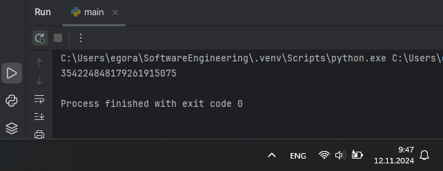

## Выводы

В данном коде считается число Фибоначчи для 100 с помощью рекурсивной функции fibonacci(). Для сохранения промежуточных результатов используется декоратор @lru_cache, который обеспечивает более быструю работу программы.

## Лабораторная работа №2
### Илья пишет свой сайт и ему необходимо сделать минимальную проверку ввода данных пользователя при регистрации. Для этого он реализовал функцию, которая выводит данные пользователя на экран и решил, что будет проверять правильность введённых данных при помощи декоратора, но в этом ему потребовалась ваша помощь. Напишите декоратор для функции, который будет принимать все параметры вызываемой функции (имя, возраст) и проверять чтобы возраст был больше 0 и меньше 130. Причем заметьте, что неважно сколько пользователь введет данных на сайт к Илье, будут обрабатываться только первые 2 аргумента.

```python
def check(input_func):
    def output_func(*args):
        name, age = args[0], args[1]

        if age <= 0 or age >= 130:
            age = 'Недопустимый возраст'
        input_func(name, age)

    return output_func

@check
def personal_info(name, age):
    print(f"Name: {name} Age: {age}")

if __name__ == '__main__':
    personal_info('Алексей', 30)
    personal_info('Николай', -3)
    personal_info('Иван', 133, 23, 10)
```
### Результат.
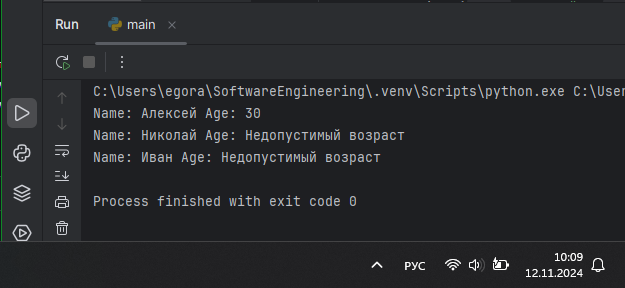

## Выводы

В данном коде для функции personal_info(), принимающей в качестве параметров имя и возраст, написан декоратор check, проверяющий, чтобы введенный возраст был больше 0 и меньше 130. Если условие не выполнено, то переменной age присваивается строковое значение "Недопустимый возраст".

## Лабораторная работа №3
### Вам понравилась идея Ильи с сайтом, и вы решили дальше работать вместе с ним. Но вот в вашем проекте появилась проблема, кто-то пытается сломать вашу функцию с получением данных для сайта. Эта функция работает только с данными integer, а какой-то недохакер пытается все сломать и вместо нужного типа данных отправляет string. Воспользуйтесь исключениями, чтобы неподходящий тип данных не ломал ваш сайт. Также дополнительно можете обернуть весь код функции в try/except/finally для того, чтобы программа вас оповестила о том, что выявлена какая-то ошибка или программа успешно выполнена.

```python
def data(*args):
    try:
        for i in range(len(*args)):
            try:
                result = (args[0][i] * 10) // 10
                print(result)
            except Exception as ex:
                print(ex)
    except Exception as ex:
        print(ex)
    finally:
        print('Вся информация обработана')

if __name__ == '__main__':
    data([1, 20, 'Hello', 'i', 'try', 'to', 'crash', 'your', 'site', 38, 45])
```
### Результат.
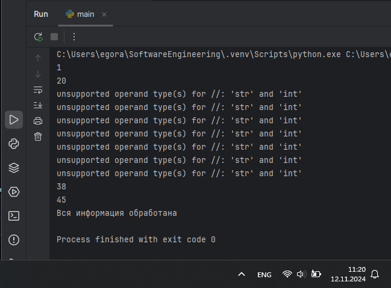

## Выводы

В данном коде проверяется, что отправленные данные соответствуют числам, для этого каждый принятый аргумент умножается на 10 и затем целочисленно делится на 10. Если это число, то все пройдет хорошо, а если это строка, то вызовется ошибка. При этом, весь код функции обернут в try/except/finally.

## Лабораторная работа №4
### Продолжая работу над сайтом, вы решили написать собственное исключение, которое будет вызываться в случае, если в функцию проверки имени при регистрации передана строка длиннее десяти символов, а если имя имеет допустимую длину, то в консоль выводиться “Успешная регистрация”

```python
class NegativeValueException(Exception):
    pass

def check_name(name):
    if len(name) > 10:
        raise NegativeValueException('Длина более 10 символов')
    else:
        print('Успешная регистрация')

if __name__ == '__main__':
    name1 = '12345'
    check_name(name1)
    
    name2 = '12345678910'
    check_name(name2)
```
### Результат.
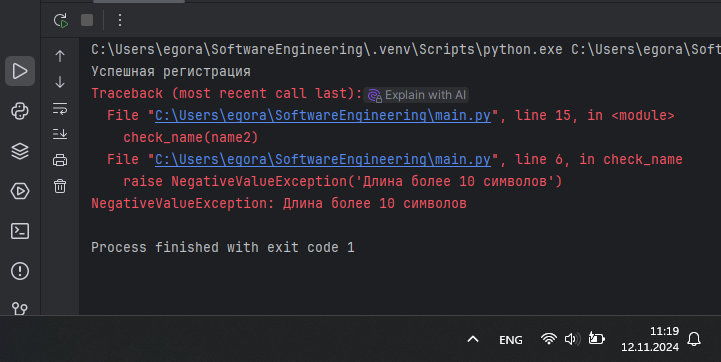

## Выводы

В данном коде создано собственное исключение NegativeValueException, которое вызывается, если длина имени составляет больше 10 символов. Если же длина 10 и менее символов, то с помощью функции check_name() выводится сообщение об успешной регистрации.

## Лабораторная работа №5
### После запуска сайта вы поняли, что вам необходимо добавить логгер, для отслеживания его работы. Готовыми вариантами вы не захотели пользоваться, и поэтому решили создать очень простую пародию. Для этого создали две функции: ___init___() (вызывается при создании класса декоратора в программе) и	___call___() (вызывается при вызове декоратора). Создайте необходимый вам декоратор. Выведите все логи в консоль.

```python
class SiteChecker:
    def __init__(self, func):
        print('> Класс SiteChecker метод __init__ успешный запуск')
        self.func = func

    def __call__(self):
        print('> Проверка перед запуском', self.func.__name__)
        self.func()
        print('> Проверка безопасного выключения')

@SiteChecker
def site():
    print('Усердная работа сайта')

if __name__ == '__main__':
    print('>> Сайт запущен')
    site()
    print('>> Сайт выключен')
```
### Результат.
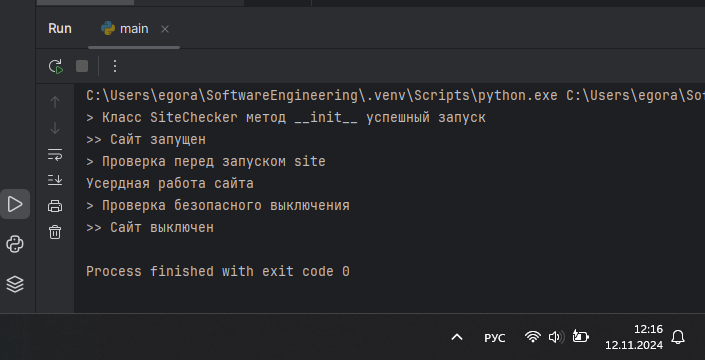

## Выводы

В данном коде реализована пародия на логгер с помощью класса декоратора SiteChecker. Класс оборачивает вызов функции и добавляет вывод сообщений-логов в консоль. При создании класса декоратора вызывается метод ___init___(), который выводит сообщение об успешном запуске. При вызове декоратора вызывается метод ___call___(), который выводит сообщения о проверке перед запуском и проверке безопасного выключения.

## Самостоятельная работа №1
### Вовочка решил заняться спортивным программированием на python, но для этого он должен знать за какое время выполняется его программа. Он решил, что для этого ему идеально подойдет декоратор для функции, который будет выяснять за какое время выполняется та или иная функция. Помогите Вовочке в его начинаниях и напишите такой декоратор. Подсказка: необходимо использовать модуль time Декоратор необходимо использовать для этой функции:
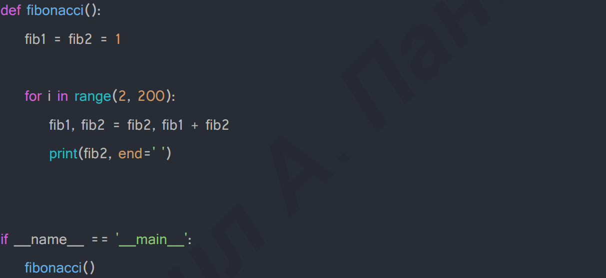
Результатом вашей работы будет листинг кода и скриншот консоли, в котором будет выполненная функция Фибоначчи и время выполнения программы. Также на этом примере можете посмотреть, что решение задач через рекурсию не всегда является хорошей идеей. Поскольку решение Фибоначчи для 100 с использованием рекурсии и без динамического программирования решается более десяти секунд, а решение точно такой же задачи, но через цикл for еще и для 200, занимает меньше 1 секунды.

```python
import time

def measure_time(func):
    def wrapper(*args, **kwargs):
        start_time = time.time()
        result = func(*args, **kwargs)
        end_time = time.time()
        execution_time = end_time - start_time
        print(f"\nВремя выполнения функции: {execution_time} секунд")
        return result
    return wrapper

@measure_time
def fibonacci():
    fib1 = fib2 = 1

    for i in range(2, 200):
        fib1, fib2 = fib2, fib1 + fib2
        print(fib2, end = ' ')

if __name__ == '__main__':
    fibonacci()
```
### Результат.
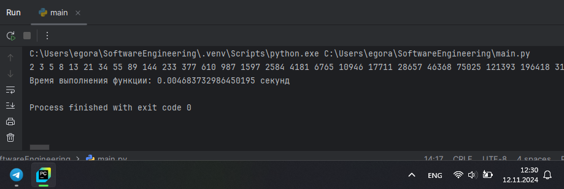

## Выводы

В данном коде создан декоратор для функции fibonacci(), вычисляющей число Фибоначчи. Декоратор вычисляет время выполнения функции: перед выполнением функции записывается текущее время (start_time), затем вызывается сама функция, после чего снова подсчитывается текущее время (end_time). Время выполнения получается путем вычета из end_time start_time.

## Самостоятельная работа №2
### Посмотрев на Вовочку, вы также загорелись идеей спортивного программирования, начав тренировки вы узнали, что для решения некоторых задач необходимо считывать данные из файлов. Но через некоторое время вы столкнулись с проблемой что файлы бывают пустыми, и вы не получаете вводные данные для решения задачи. После этого вы решили не просто считывать данные из файла, а всю конструкцию оборачивать в исключения, чтобы избежать такой проблемы. Создайте пустой файл и файл, в котором есть какая-то информация. Напишите код программы. Если файл пустой, то, нужно вызвать исключение (“бросить исключение”) и вывести в консоль “файл пустой”, а если он не пустой, то вывести информацию из файла.

```python
def read_file(file_path):
    try:
        with open(file_path, 'r') as file:
            data = file.read()
            if not data:
                raise ValueError("Файл пустой")
            print(data)
    except ValueError as ex:
        print(ex)
    except Exception as e:
        print(f"Ошибка: {e}")

if __name__ == '__main__':
    print("Чтение из заполненного файла:")
    read_file("file.txt")

    print("Чтение из пустого файла:")
    read_file("empty_file.txt")
```
### Результат.
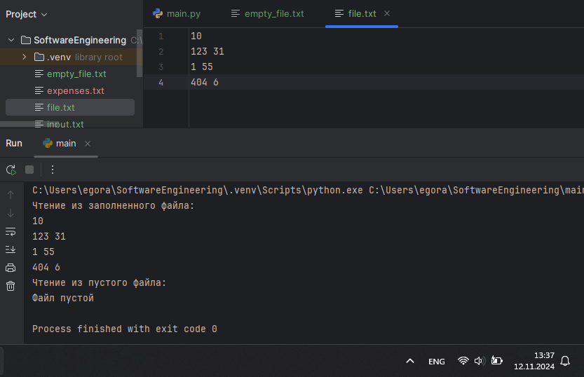

## Выводы

В данном коде реализована работа функции read_file(), которая считывает данные из файла, используя конструкцию try/except. Если файл пустой, то вызывается исключение ValueError, а в консоль выводится соответствующее сообщение. Также ниже реализована обработка прочих исключений, которые могут возникнуть. Если файл не пустой, то функция считывает данные из файла и выводит их в консоль.

## Самостоятельная работа №3
### Напишите функцию, которая будет складывать 2 и введенное пользователем число, но если пользователь введет строку или другой неподходящий тип данных, то в консоль выведется ошибка “Неподходящий тип данных. Ожидалось число.”. Реализовать функционал программы необходимо через try/except и подобрать правильный тип исключения. Создавать собственное исключение нельзя. Проведите несколько тестов, в которых исключение вызывается и нет. Результатом выполнения задачи будет листинг кода и получившийся вывод в консоль

```python
def add_two():
    number = input("Введите число: ")
    try:
        result = 2 + float(number)
        print(f"Результат: {result}")
    except ValueError:
        print('Неподходящий тип данных. Ожидалось число.')

add_two()
add_two()
add_two()
add_two()
```
### Результат.
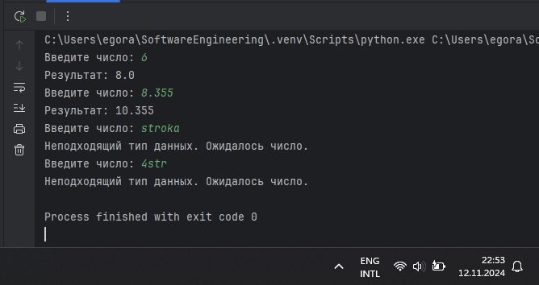

## Выводы

В данном коде реализована работа функции add_two(), которая складывает 2 и введенное пользователем число. В блоке try введенное число преобразуется в тип float для возможности сложить дробное число. Если в качестве введенного числа была строка, то на этом этапе вызовется исключение ValueError, поскольку строковое значение не получится преобразовать в дробное, а соответственно и сложить с числом 2.

## Самостоятельная работа №4
### Создайте собственный декоратор, который будет использоваться для двух любых вами придуманных функций. Декораторы, которые использовались ранее в работе нельзя воссоздавать. Результатом выполнения задачи будет: класс декоратора, две как-то связанными с ним функциями, скриншот консоли с выполненной программой и подробные комментарии, которые будут описывать работу вашего кода. Придуманное задание:

Необходимо создать класс декоратора, который должен выводить минимальное, максимальное и среднее число из массива, передаваемого в две функции. Первая функция должна принимать массив и производить сортировку чисел в нем, потом возвращать получившийся отсортированный массив. Вторая функция должна принимать массив чисел и возвращать массив с неотрицательными элементами.

```python

```
### Результат.
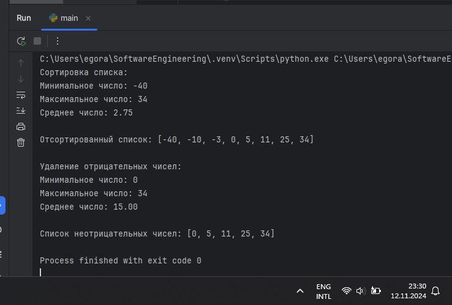

## Выводы

В данном коде 

## Самостоятельная работа №5
### Создайте собственное исключение, которое будет использоваться в двух любых фрагментах кода. Исключения, которые использовались ранее в работе нельзя воссоздавать. Результатом выполнения задачи будет: класс исключения, код к котором в двух местах используется это исключение, скриншот консоли с выполненной программой и подробные комментарии, которые будут описывать работу вашего кода.

```python

```
### Результат.
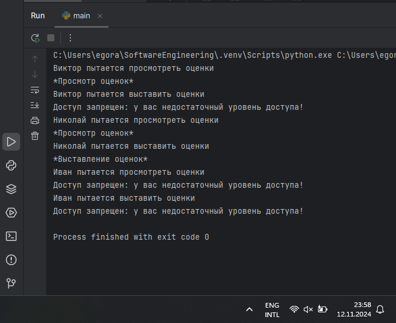

## Выводы

В данном коде 

## Общие выводы по теме
- Развернутый вывод
