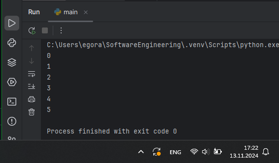
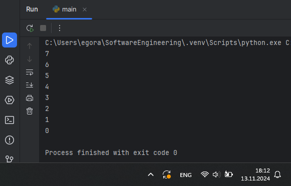
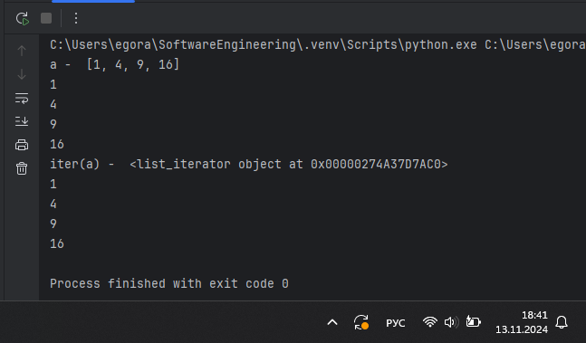
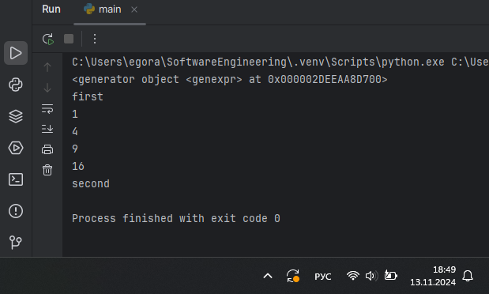
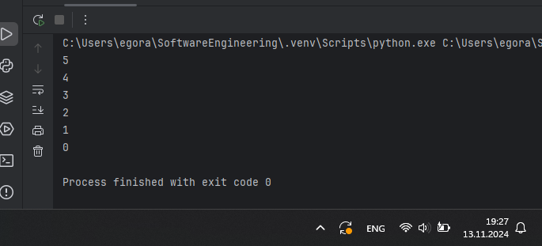
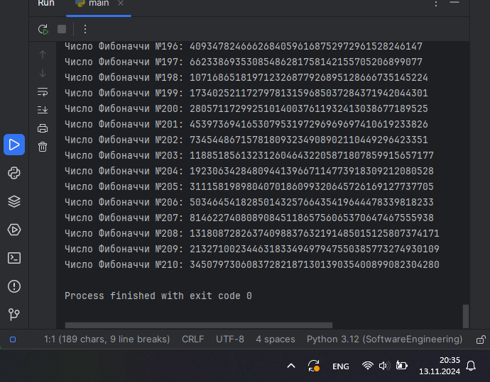
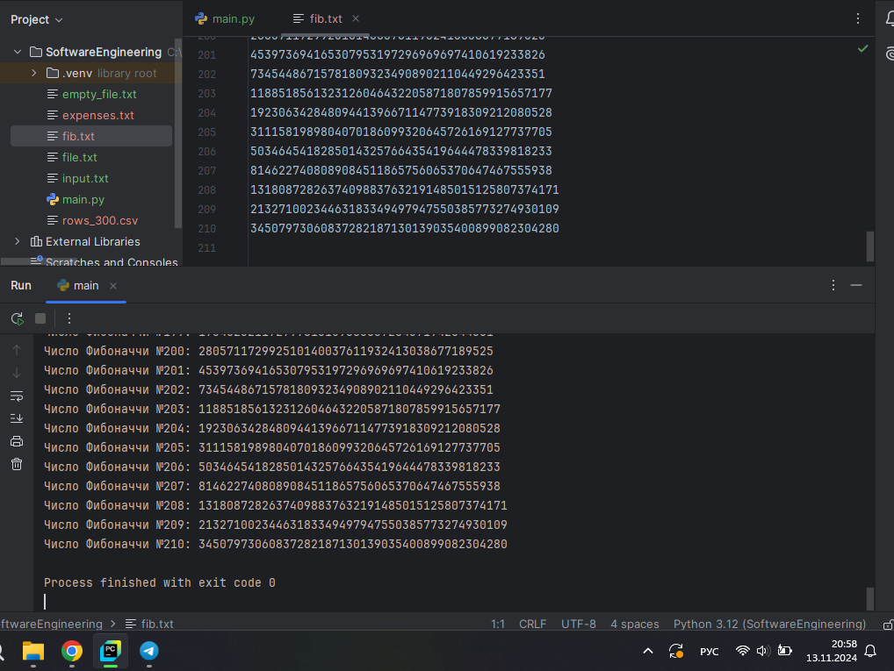

# Тема 11. Итераторы и генераторы
Отчет по Теме #11 выполнил(а):
- Аверкиев Егор Алексеевич
- ИВТ-22-1

| Задание | Лаб_раб | Сам_раб |
| ------ | ------ | ------ |
| Задание 1 | + | + |
| Задание 2 | + | + |
| Задание 3 | + |  |
| Задание 4 | + |  |
| Задание 5 | + |  |

знак "+" - задание выполнено; знак "-" - задание не выполнено;

Работу проверили:
- к.э.н., доцент Панов М.А.

## Лабораторная работа №1
### Простой итератор, но у него нет гибкой настройки, например его нельзя развернуть. Он работает просто как next(), но нет prev()

```python
numbers = [0, 1, 2, 3, 4, 5]
for item in numbers:
    print(item)
```
### Результат.


## Выводы

В данном коде показан пример простого итератора, не имеющего гибкой настройки. Сначала создается список numbers, затем происходит проход по каждому элементу из этого списка и вывод этих элементов.

## Лабораторная работа №2
### Класс итератор с гибкой настройкой и удобными применением

```python
class CountDown:
    def __init__(self, start):
        self.count = start + 1

    def __iter__(self):
        return self

    def __next__(self):
        self.count -= 1
        if self.count < 0:
            raise StopIteration
        return self.count

if __name__ == '__main__':
    counter = CountDown(7)
    for i in counter:
        print(i)
```
### Результат.


## Выводы

В данном коде показан пример итератора с гибкой настройкой и удобным применением. Был создан класс CountDown, который представляет собой итератор. Он принимает число start в качестве аргумента конструктора, которое показывает, с какого числа нужно начинать генерировать числа до 0 включительно.

## Лабораторная работа №3
### Генератор списка

```python
a = [i ** 2 for i in range(1,5)]

print('a - ', a)
for i in a:
    print(i)

print('iter(a) - ', iter(a))
for i in a:
    print(i)
```
### Результат.


## Выводы

В данном коде показан пример генератора списка. Сначала создается список a, содержащий квадраты чисел от 1 до 4. Затем выводится сам список и его каждый элемент отдельно. Далее выводится итератор списка с помощью iter(a) и повторно все элементы списка a.

## Лабораторная работа №4
### Выражения генераторы

```python
b = (i ** 2 for i in range(1, 5))
print(b)
print('first')
for i in b:
    print(i)
print('second')
for i in b:
    print(i)
```
### Результат.


## Выводы

В данном коде создается генераторное выражение b. С помощью print(b) выводится представление объекта генератора. Затем продемонстрировано то, что из-за особенностей выражений генераторов, они не будут выводиться повторно.

## Лабораторная работа №5
### Такой же счетчик, как и в первом задании, только это генератор и использует yield

```python
def countdown(count):
    while count >= 0:
        yield count
        count -= 1

if __name__ == '__main__':
    counter = countdown(5)
    for i in counter:
        print(i)
```
### Результат.


## Выводы

В данном коде создана функция countdown(), которая является генератором и возвращает объект-генератор. Происходит вызов этой функции, а затем вывод последовательности чисел от count до 0 включительно.

## Самостоятельная работа №1
### Вас никак не могут оставить числа Фибоначчи, очень уж они вас заинтересовали. Изучив новые возможности Python вы решили реализовать программу, которая считает числа Фибоначчи при помощи итераторов. Расчет начинается с чисел 1 и 1. Создайте функцию fib(n), генерирующую n чисел Фибоначчи с минимальными затратами ресурсов. Для реализации этой функции потребуется обратиться к инструкции yield (Она не сохраняет в оперативной памяти огромную последовательность, а дает возможность “доставать” промежуточные результаты по одному). Результатом решения задачи будет листинг кода и вывод в консоль с числом Фибоначчи от 200.

```python
def fib(n):
    a, b = 1, 1
    for i in range(n):
        yield a
        a, b = b, a + b

count = 1
for number in fib(210):
    print(f"Число Фибоначчи №{count}: {number}")
    count += 1
```
### Результат.


## Выводы

В данном коде реализован генератор чисел Фибоначчи, начиная с 1, 1. Функция fib(n) генерирует n чисел Фибоначчи, используя yield для экономии ресурсов. В цикле for происходит итерация по сгенерированным числам и их вывод в консоль с порядковым номером до 210 включительно.

## Самостоятельная работа №2
### К коду предыдущей задачи добавьте запоминание каждого числа Фибоначчи в файл “fib.txt”, при этом каждое число должно находиться на отдельной строчке. Результатом выполнения задачи будет листинг кода и скриншот получившегося файла

```python
def fib(n):
    a, b = 1, 1
    for i in range(n):
        yield a
        a, b = b, a + b

count = 1
with open('fib.txt', 'w') as f:
    for number in fib(210):
        f.write(f"{number}\n")
        print(f"Число Фибоначчи №{count}: {number}")
        count += 1
```
### Результат.


## Выводы

В данном коде реализован генератор чисел Фибоначчи, начинаяс с 1, 1 с их запоминанием, т.е. записью в текстовый файл fib.txt. Функция fib(n) все так же генерирует n чисел Фибоначчи, как и в предыдущей задаче. Вне этой функции дополнительно открывается файл fib.txt в режиме записи и в цикле for каждый раз записывается сгенерированное число в этот файл.

## Общие выводы по теме
Итераторы и генераторы в Python являются мощными и крайне полезными инструментами для эффективной работы с последовательностями данных. Итераторы хороши тем, что позволяют перебирать элементы коллекций по одному за раз, при этом не загружая всю коллекцию в память. Это значительно повышает оптимизацию и экономит ресурсы. Генераторы также полезны, поскольку с помощью них можно создавать бесконечные последовательности данных без необходимости хранить их в памяти.
