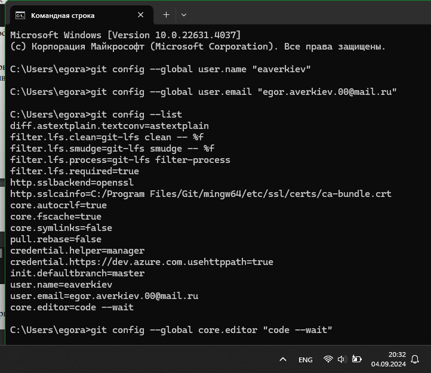

# Тема 2. Базовые операции языка Python
Отчет по Теме #2 выполнил(а):
- Аверкиев Егор Алексеевич
- ИВТ-22-1

| Задание | Лаб_раб | Сам_раб |
| ------ | ------ | ------ |
| Задание 1 | + | + |
| Задание 2 | + | + |
| Задание 3 | + | + |
| Задание 4 | + | + |
| Задание 5 | + | + |
| Задание 6 | + | + |
| Задание 7 | + | + |
| Задание 8 | + | + |
| Задание 9 | + | + |
| Задание 10 | + | + |

знак "+" - задание выполнено; знак "-" - задание не выполнено;

Работу проверили:
- к.э.н., доцент Панов М.А.

## Лабораторная работа №1
### Выведите в консоль три строки. Первая – любое число. Вторая – любое число в виде строки. Третья – любое число с плавающей точкой.

```python
print(123)
print('123')
print(1.23)
```
### Результат.


## Выводы

В данном коде выводятся три строки с использованием функции `print()`. Первая строка выводит целое число 123, вторая строка выводит строку '123' (в виде текстовой строки, а не числа), а третья строка выводит число с плавающей точкой.

## Лабораторная работа №2
- Текст задания
- Оформленный код
- Скрины консоли
- Краткие Выводы

## Лабораторная работа №3
- Текст задания
- Оформленный код
- Скрины консоли
- Краткие Выводы
  
## Лабораторная работа №4
- Текст задания
- Оформленный код
- Скрины консоли
- Краткие Выводы

## Лабораторная работа №5
- Текст задания
- Оформленный код
- Скрины консоли
- Краткие Выводы

## Лабораторная работа №6
- Текст задания
- Оформленный код
- Скрины консоли
- Краткие Выводы

## Лабораторная работа №7
- Текст задания
- Оформленный код
- Скрины консоли
- Краткие Выводы

## Лабораторная работа №8
- Текст задания
- Оформленный код
- Скрины консоли
- Краткие Выводы

## Лабораторная работа №9
- Текст задания
- Оформленный код
- Скрины консоли
- Краткие Выводы

## Лабораторная работа №10
- Текст задания
- Оформленный код
- Скрины консоли
- Краткие Выводы

## Самостоятельная работа №1
- Текст задания
- Оформленный код
- Скрины консоли
- Развернутый вывод
  
## Самостоятельная работа №2
- Текст задания
- Оформленный код
- Скрины консоли
- Развернутый вывод
  
## Самостоятельная работа №3
- Текст задания
- Оформленный код
- Скрины консоли
- Развернутый вывод
  
## Самостоятельная работа №4
- Текст задания
- Оформленный код
- Скрины консоли
- Развернутый вывод
  
## Самостоятельная работа №5
- Текст задания
- Оформленный код
- Скрины консоли
- Развернутый вывод
  
## Самостоятельная работа №6
- Текст задания
- Оформленный код
- Скрины консоли
- Развернутый вывод
  
## Самостоятельная работа №7
- Текст задания
- Оформленный код
- Скрины консоли
- Развернутый вывод
  
## Самостоятельная работа №8
- Текст задания
- Оформленный код
- Скрины консоли
- Развернутый вывод
  
## Самостоятельная работа №9
- Текст задания
- Оформленный код
- Скрины консоли
- Развернутый вывод
  
## Самостоятельная работа №10
- Текст задания
- Оформленный код
- Скрины консоли
- Развернутый вывод

## Общие выводы по теме
- Развернутый вывод
