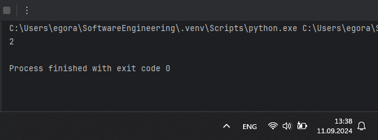
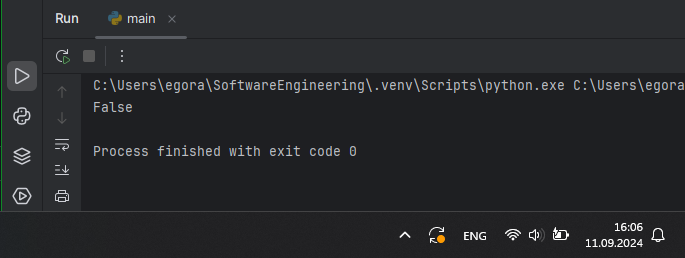
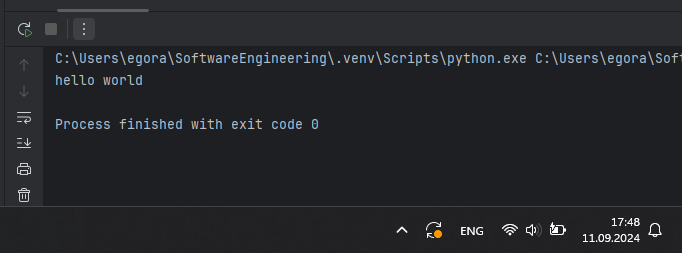
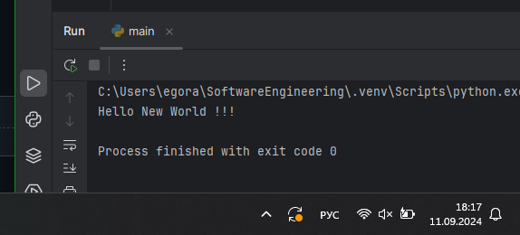

# Тема 2. Базовые операции языка Python
Отчет по Теме #2 выполнил(а):
- Аверкиев Егор Алексеевич
- ИВТ-22-1

| Задание | Лаб_раб | Сам_раб |
| ------ | ------ | ------ |
| Задание 1 | + | + |
| Задание 2 | + | + |
| Задание 3 | + | + |
| Задание 4 | + | + |
| Задание 5 | + | + |
| Задание 6 | + | + |
| Задание 7 | + | + |
| Задание 8 | + | + |
| Задание 9 | + | + |
| Задание 10 | + | + |

знак "+" - задание выполнено; знак "-" - задание не выполнено;

Работу проверили:
- к.э.н., доцент Панов М.А.

## Лабораторная работа №1
### Выведите в консоль три строки. Первая – любое число. Вторая – любое число в виде строки. Третья – любое число с плавающей точкой.

```python
print(123)
print('123')
print(1.23)
```
### Результат.


## Выводы

В данном коде выводятся три строки с использованием функции `print()`. Первая строка выводит целое число `123`, вторая строка выводит строку `'123'` (уже в виде текстовой строки, а не числа), а третья строка выводит число `1.23` с плавающей точкой (в виде числа, как и в 1 случае).

## Лабораторная работа №2
### Выведите в консоль три строки. Первая – результат сложения или вычитания минимум двух переменных типа int. Вторая – результат сложения или вычитания минимум двух переменных типа float. Третья – результат сложения или вычитания минимум двух переменных типа int и float.

```python
print(123 + 321)
print(12.3 - 3.21)
print(10 + 20.15 + 1 + 3.66)
```
### Результат.


## Выводы

В данном коде производятся математические операции сложения и вычитания целых чисел и чисел с плавающей точкой. Результаты этих операций выводятся на экран с помощью функции `print()`. При сложении/вычитании целых чисел результатом будет являться целое число. Если же в сложении/вычитании будет участвовать хотя бы одно число с плавающей точкой, то результатом будет число с плавающей точкой.

## Лабораторная работа №3
### Выведите в консоль три строки. Первая – обычная строка. Вторая – F строка с использованием заранее объявленной переменной. Третья – сложите две или более строк в одну.

```python
print('Hello World!')

world = 'World'
print(f"Hello {world}!")

one = 'Hello'
two = ' '
three = 'World!'
print(one + two + three)
```
### Результат.


## Выводы

В данном коде выводятся 3 строки 3 разными способами с использованием функции `print()`. В первом случае просто выводится одна целая строка. Во втором случае дополнительно используется F строка. В третьем случае 3 строки складываются в одну целую.

## Лабораторная работа №4
### Выведите в консоль три строки. Первая – трансформация любого типа переменной в bool. Вторая – трансформация любого типа переменной в float или int. Третья – трансформация любого типа переменной в str.

```python
one = 'No'
print(bool(one))

two = 123
print(float(two))

three = 300.33
print(str(three))
```
### Результат.


## Выводы

В данном коде происходят преобразования значений переменных из одного типа в другой: в первом случае из str в bool (выводится True), во втором случае из int в float (к 123 добавляется дробная часть и выводится 123.0), в третьем случае из float в str (выводится 300.33, но уже как строка, а не число).

## Лабораторная работа №5
### Присвойте трем переменным различные значения, воспользовавшись функцией input().

```python
one = input('one: ')
two = input('two: ')
three = input('three: ')
print(one, two, three)
```
### Результат.


## Выводы

В данном коде трем переменным присваиваются значения путем пользовательского ввода с клавиатуры, а затем значения переменных выводятся на экран.

## Лабораторная работа №6
### Создайте две любые числовые переменные и выполните над ними несколько математических операций: возведение в степень, обычное деление, целочисленное деление, нахождение остатка от деления. При желании вы можете проверить как работают эти вычисления с разными типами данных, например, сначала создать две переменные int, затем создать две переменные float и наконец создать переменные типа int и float и провести над ними операции, прописанные выше.

```python
one = 10
two = 3
print('Возведение в степень: ', one ** two)
print('Обычное деление: ', one / two)
print('Целочисленное деление: ', one // two)
print('Нахождение остатка от деления: ', one % two)
```
### Результат.


## Выводы

В данном коде производятся математические операции над двумя числами. В первой строке вывода показан результат от возведения 10 в 3 степень (операция **). Во второй строке вывода показан результат от деления 10 на 3 (операция /). В третьей строке вывода показан результат от целочисленного деления 10 на 3 (операция //). В четвертой строке вывода показан результат от нахождения остатка от деления 10 на 3 (операция %).

## Лабораторная работа №7
### Создайте любую строковую переменную и произведите над ней математическое действие умножение на любое число.

```python

```
### Результат.


## Выводы

В данном коде 

## Лабораторная работа №8
### Посчитайте сколько раз символ ‘o’ встречается в строке ‘Hello World’.

```python

```
### Результат.


## Выводы

В данном коде 

## Лабораторная работа №9
### Напишите предложение ‘Hello World’ в две строки. Написанная программа должна занимать одну строку в редакторе кода.

```python

```
### Результат.


## Выводы

В данном коде 

## Лабораторная работа №10
### Из предложения ‘Hello World’ выведите в консоль только 2 символ, а затем выведите слово ‘Hello’

```python

```
### Результат.


## Выводы

В данном коде 

## Самостоятельная работа №1
### 

```python

```
### Результат.


## Выводы

В данном коде 

## Самостоятельная работа №2
### 

```python

```
### Результат.


## Выводы

В данном коде 

## Самостоятельная работа №3
### 

```python

```
### Результат.


## Выводы

В данном коде 

## Самостоятельная работа №4
### 

```python

```
### Результат.


## Выводы

В данном коде 

## Самостоятельная работа №5
### 

```python

```
### Результат.


## Выводы

В данном коде 

## Самостоятельная работа №6
### 

```python

```
### Результат.


## Выводы

В данном коде 

## Самостоятельная работа №7
### 

```python

```
### Результат.


## Выводы

В данном коде 

## Самостоятельная работа №8
### 

```python

```
### Результат.


## Выводы

В данном коде 

## Самостоятельная работа №9
### 

```python

```
### Результат.


## Выводы

В данном коде 

## Самостоятельная работа №10
### 

```python

```
### Результат.


## Выводы

В данном коде 

## Общие выводы по теме
- Развернутый вывод
