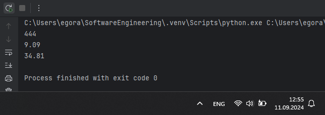
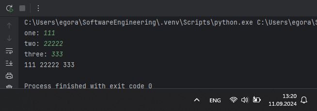
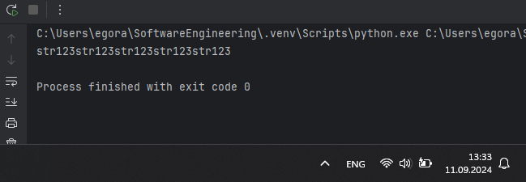
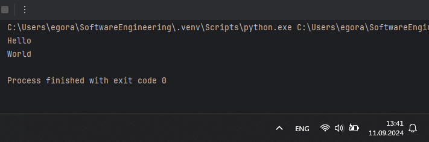
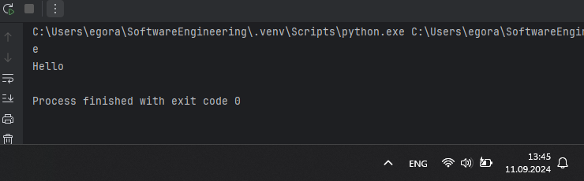
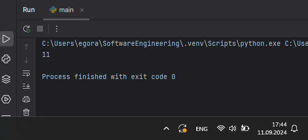

# Тема 2. Базовые операции языка Python
Отчет по Теме #2 выполнил(а):
- Аверкиев Егор Алексеевич
- ИВТ-22-1

| Задание | Лаб_раб | Сам_раб |
| ------ | ------ | ------ |
| Задание 1 | + | + |
| Задание 2 | + | + |
| Задание 3 | + | + |
| Задание 4 | + | + |
| Задание 5 | + | + |
| Задание 6 | + | + |
| Задание 7 | + | + |
| Задание 8 | + | + |
| Задание 9 | + | + |
| Задание 10 | + | + |

знак "+" - задание выполнено; знак "-" - задание не выполнено;

Работу проверили:
- к.э.н., доцент Панов М.А.

## Лабораторная работа №1
### Выведите в консоль три строки. Первая – любое число. Вторая – любое число в виде строки. Третья – любое число с плавающей точкой.

```python
print(123)
print('123')
print(1.23)
```
### Результат.


## Выводы

В данном коде выводятся три строки с использованием функции `print()`. Первая строка выводит целое число `123`, вторая строка выводит строку `'123'` (уже в виде текстовой строки, а не числа), а третья строка выводит число `1.23` с плавающей точкой (в виде числа, как и в 1 случае).

## Лабораторная работа №2
### Выведите в консоль три строки. Первая – результат сложения или вычитания минимум двух переменных типа int. Вторая – результат сложения или вычитания минимум двух переменных типа float. Третья – результат сложения или вычитания минимум двух переменных типа int и float.

```python

```
### Результат.


## Выводы

В данном коде 

## Лабораторная работа №3
### Выведите в консоль три строки. Первая – обычная строка. Вторая – F строка с использованием заранее объявленной переменной. Третья – сложите две или более строк в одну.

```python

```
### Результат.


## Выводы

В данном коде 

## Лабораторная работа №4
### Выведите в консоль три строки. Первая – трансформация любого типа переменной в bool. Вторая – трансформация любого типа переменной в float или int. Третья – трансформация любого типа переменной в str.

```python

```
### Результат.


## Выводы

В данном коде 

## Лабораторная работа №5
### Присвойте трем переменным различные значения, воспользовавшись функцией input().

```python

```
### Результат.


## Выводы

В данном коде 

## Лабораторная работа №6
### Создайте две любые числовые переменные и выполните над ними несколько математических операций: возведение в степень, обычное деление, целочисленное деление, нахождение остатка от деления. При желании вы можете проверить как работают эти вычисления с разными типами данных, например, сначала создать две переменные int, затем создать две переменные float и наконец создать переменные типа int и float и провести над ними операции, прописанные выше.

```python

```
### Результат.


## Выводы

В данном коде 

## Лабораторная работа №7
### Создайте любую строковую переменную и произведите над ней математическое действие умножение на любое число.

```python

```
### Результат.


## Выводы

В данном коде 

## Лабораторная работа №8
### Посчитайте сколько раз символ ‘o’ встречается в строке ‘Hello World’.

```python

```
### Результат.


## Выводы

В данном коде 

## Лабораторная работа №9
### Напишите предложение ‘Hello World’ в две строки. Написанная программа должна занимать одну строку в редакторе кода.

```python

```
### Результат.


## Выводы

В данном коде 

## Лабораторная работа №10
### Из предложения ‘Hello World’ выведите в консоль только 2 символ, а затем выведите слово ‘Hello’

```python

```
### Результат.


## Выводы

В данном коде 

## Самостоятельная работа №1
### 

```python

```
### Результат.


## Выводы

В данном коде 

## Самостоятельная работа №2
### 

```python

```
### Результат.


## Выводы

В данном коде 

## Самостоятельная работа №3
### 

```python

```
### Результат.


## Выводы

В данном коде 

## Самостоятельная работа №4
### 

```python

```
### Результат.


## Выводы

В данном коде 

## Самостоятельная работа №5
### 

```python

```
### Результат.


## Выводы

В данном коде 

## Самостоятельная работа №6
### 

```python

```
### Результат.


## Выводы

В данном коде 

## Самостоятельная работа №7
### 

```python

```
### Результат.


## Выводы

В данном коде 

## Самостоятельная работа №8
### 

```python

```
### Результат.


## Выводы

В данном коде 

## Самостоятельная работа №9
### 

```python

```
### Результат.


## Выводы

В данном коде 

## Самостоятельная работа №10
### 

```python

```
### Результат.


## Выводы

В данном коде 

## Общие выводы по теме
- Развернутый вывод
