# Тема 3. Операторы, условия, циклы
Отчет по Теме #3 выполнил(а):
- Аверкиев Егор Алексеевич
- ИВТ-22-1

| Задание | Лаб_раб | Сам_раб |
| ------ | ------ | ------ |
| Задание 1 | + | + |
| Задание 2 | + | + |
| Задание 3 | + | + |
| Задание 4 | + | + |
| Задание 5 | + | + |
| Задание 6 | + |  |
| Задание 7 | + |  |
| Задание 8 | + |  |
| Задание 9 | + |  |
| Задание 10 | + |  |

знак "+" - задание выполнено; знак "-" - задание не выполнено;

Работу проверили:
- к.э.н., доцент Панов М.А.

## Лабораторная работа №1
### Создайте две переменные, значение которых будете вводить через консоль. Также составьте условие, в котором созданные ранее переменные будут сравниваться, если условие выполняется, то выведете в консоль «Выполняется», если нет, то «Не выполняется».

```python
one = int(input('Первая переменная: '))
two = int(input('Вторая переменная: '))
if one >= two:
    print('Выполняется')
else:
    print('Не выполняется')
```
### Результат.


## Выводы

В данном коде сначала 2 переменные вводятся пользователем, а затем они же сравниваются. Если переменная one больше или равна переменной two, то в консоль выводится "Выполняется", а иначе - "Не выполняется".

## Лабораторная работа №2
### Напишите программу, которая будет определять значения переменной меньше 0, больше 0 и меньше 10 или больше 10. Это нужно реализовать при помощи одной переменной, значение которой будет вводится через консоль, а также при помощи конструкций if, elif, else.

```python
one = int(input('Введите значение переменной: '))
if one < 0:
    print('Переменная < 0')
elif 0 < one < 10:
    print('Переменная > 0 и < 10')
else:
    print('Переменная > 10')
```
### Результат.
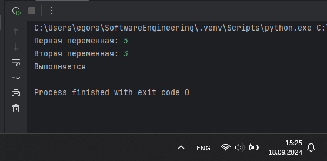

## Выводы

В данном коде пользователь вводит значение переменной one, которая затем сравнивается и выводится соответствующее сообщение в 3 этапа: 1) если она меньше 0; 2) если она больше 0, но меньше 10; 3) в ином случае (т.е., когда она больше 10).

## Лабораторная работа №3
### Напишите программу, в которой будет проверяться есть ли переменная в указанном массиве используя логический оператор in. Самостоятельно посмотрите, как работает программа со значениями которых нет в массиве numbers.

```python
arr = [1, 2, 3, 4, 5]
value = int(input('Введите значение переменной: '))
if value in arr:
    print('Переменная есть в массиве')
else:
    print('Переменной нет в массиве')
```
### Результат.
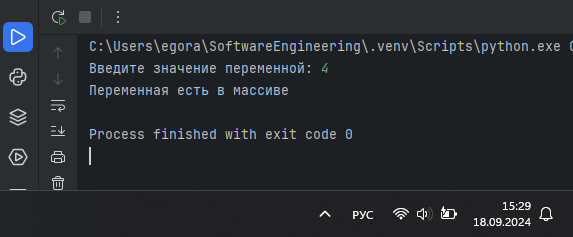

## Выводы

В данном коде сначала пользователем вводится значение переменной value. Затем проверяется, есть ли значение этой переменной в массиве arr, после чего выводится в консоль соответствующее сообщение.

## Лабораторная работа №4
### Напишите программу, которая будет определять находится ли переменная в указанном массиве и если да, то проверьте четная она или нет. Самостоятельно протестируйте данную программу с разными значениями переменной value. 

```python
arr = [1, 2, 3, 4, 5, 6, 7]
value = int(input('Введите значение переменной: '))
if value in arr:
    if value % 2 == 0:
        print('Переменная есть в массиве и она четная')
    else:
        print('Переменная есть в массиве и она нечетная')
else:
    print(f"Переменной нет в массиве и она равна {value}")
```
### Результат.
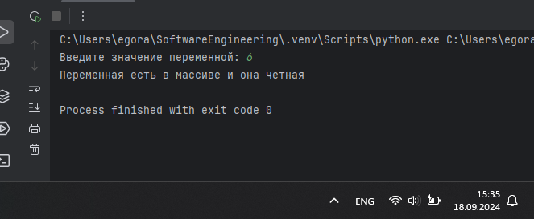

## Выводы

В данном коде сначала пользователь вводит значение переменной, а затем сначала проверяется, есть ли она в массиве. Если она есть в массиве, то дальше проверяется, четная ли она. В результате выводится соответствующее сообщение.

## Лабораторная работа №5
### Напишите программу, в которой циклом for значения переменной i будут меняться от 0 до 10 и посмотрите, как разные виды сравнений и операций работают в цикле.

```python
for i in range(10):
    print('i = ', i)
    if i == 0:
        i += 2
    if i == 1:
        continue
    if i == 2 or i == 3:
        print('Переменная равна 2 или 3')
    elif i in [4, 5, 6]:
        print('Переменная равна 4, 5 или 6')
    else:
        break
```
### Результат.
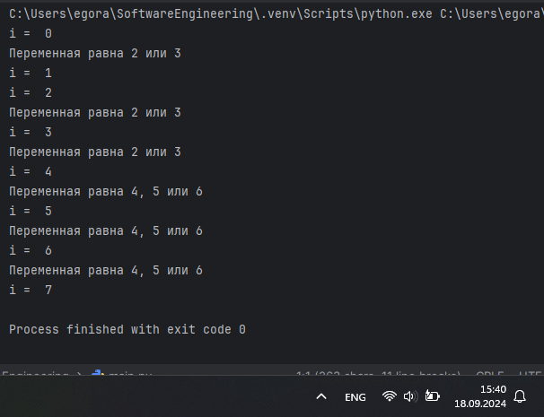

## Выводы

В данном коде переменная i меняется от 0 до 10. Каждый раз происходит несколько проверок для переменной i и выполняются определенные действия при истинности условий. Так, например, если i равна 0, то к ней прибавляется 2; если i равна 1, то происходит переход к следующей итерации цикла; если i равна 2, 3, 4, 5 или 6, то выводится сообщение в консоль; иначе, если ни одно условие не выполнилось, то происходит выход из цикла.

## Лабораторная работа №6
### Напишите программу, в которой при помощи цикла for определяется есть ли переменная value в строке string и посмотрите, как работает оператор else для циклов. Самостоятельно посмотрите, что выведет программа, если значение переменной value оказалось в строке string. 

```python
string = 'Привет всем изучающим Python!'
value = input()
for i in string:
    if i == value:
        index = string.find(value)
        print(f"Буква '{value}' есть в строке под {index} индексом")
        break
else:
    print(f"Буквы '{value}' нет в указанной строке")
```
### Результат.
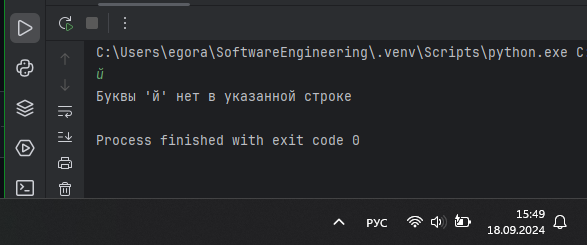

## Выводы

В данном коде пользователь вводит символ, после чего проверяется, есть ли этот символ в строке 'Привет всем изучающим Python!'. Если такой символ найден, то выводится соответствующее сообщение с индексом первого встреченного символа в строке, иначе выводится сообщение об отсутствии символа.

## Лабораторная работа №7
### Напишите программу, в которой вы наглядно посмотрите, как работает цикл for проходя в обратном порядке, то есть, к примеру не от 0 до 10, а от 10 до 0. В уже готовой программе показано вычитание из 100, а вам во время реализации программы будет необходимо придумать свой вариант применения обратного цикла.

```python
for i in range(50, -1, -5):
    i += i
    print(i)
```
### Результат.
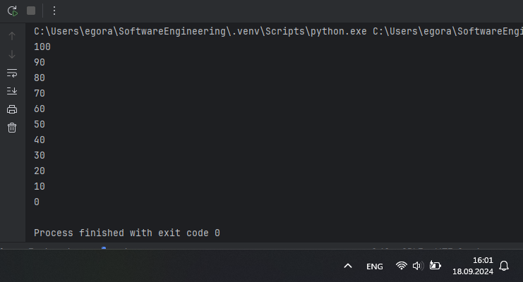

## Выводы

В данном коде показана работа цикла for, который проходит в обратном порядке от 50 до 0 с шагом -5. Каждый раз к переменной i, которая изменяется при каждой итерации цикла, прибавляется ее текущее значение. Получившееся значение каждый раз выводится на экран.

## Лабораторная работа №8
### Напишите программу используя цикл while, внутри которого есть какие-либо проверки, но быть осторожным, поскольку циклы while при неправильно написанных условиях могут становится бесконечными, как указано в примере далее.

```python
value = 0
while value < 100:
    if value == 0:
        value += 10
    elif value // 5 > 1:
        value *= 5
    else:
        value -= 5
    print(value)
```
### Результат.
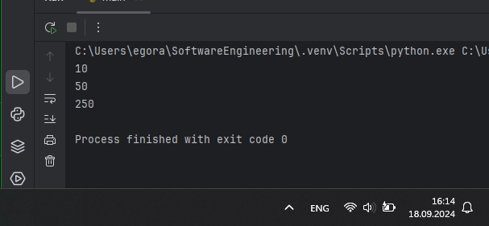

## Выводы

В данном коде выполняется цикл while до тех пор, пока переменная value не станет больше или равна 100. Внутри цикла есть несколько условий, при истинности которых значение переменной будет меняться. Результат изменившейся переменной каждый раз выводится в консоль.

## Лабораторная работа №9
### Напишите программу с использованием вложенных циклов и одной проверкой внутри них. Самое главное, не забудьте, что нельзя использовать одинаковые имена итерируемых переменных, когда вы используете вложенные циклы.

```python
value = 0
for i in range(10):
    for j in range(10):
        if i != j:
            value += j
        else:
            value -= j
print(value)
```
### Результат.
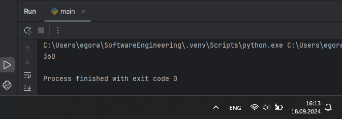

## Выводы

В данном коде выполняются 2 цикла, один из которых вложен в другой. Во внутреннем цикле проверяется равенство переменной i переменной j: если не равна, то переменной value прибавляется значение переменной j, а иначе значение переменной j вычитается. Результат после всех итераций циклов выводится в консоль.

## Лабораторная работа №10
### Напишите программу с использованием flag, которое будет определять есть ли нечетное число в массиве. В данной задаче flag выступает в роли индикатора встречи нечетного числа в исходном массиве, четных чисел.

```python
arr = [2, 4, 6, 8, 9]
flag = False
for value in arr:
    if value % 2 == 1:
        flag = True
if flag:
    print('В массиве есть нечетное число')
else:
    print('В массиве нет нечетных чисел')
```
### Результат.
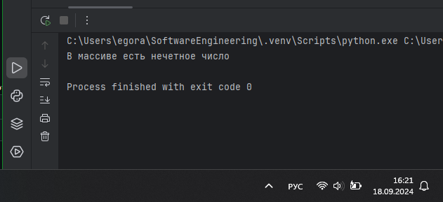

## Выводы

В данном коде цикл for проходится по всем элементам массива и определяет, есть ли в массиве нечетное число (его остаток от деления на 2 должен быть равен 1). Если такое число нашлось, то флагу присваивается значение True вместо изначального False. После цикла по значению флага определяется наличие нечетного числа в массиве: если значение флага = Истина, то такое число есть, а иначе - нет.

## Самостоятельная работа №1
### Напишите программу, которая преобразует 1 в 31.
Для выполнения поставленной задачи необходимо обязательно и только один раз использовать:

•	Цикл for

•	*= 5

•	+= 1

Никаких других действий или циклов использовать нельзя.

```python
result = 1
for i in range(2):
    result *= 5
    result += 1
print(result)
```
### Результат.
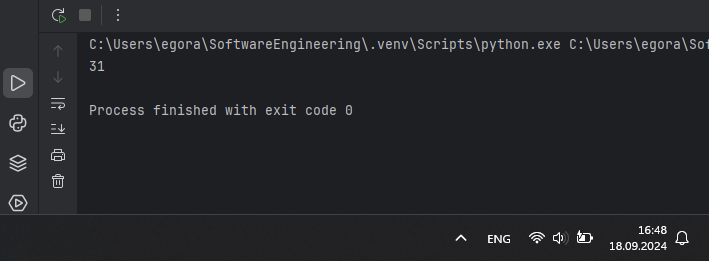

## Выводы

В данном коде происходит 2 итерации цикла for, в котором переменная result сначала умножается на 5, а затем к ней прибавляется 1. В итоге преобразование 1 в 31 выглядит так: 1-5-6-30-31.

## Самостоятельная работа №2
### Напишите программу, которая фразу «Hello World» выводит в обратном порядке, и каждая буква находится в одной строке консоли. При этом необходимо обязательно использовать любой цикл, а также программа должна занимать не более 3 строк в редакторе кода.

```python
line = 'Hello World'
for i in range(len(line)-1, -1, -1):
    print(line[i])
```
### Результат.
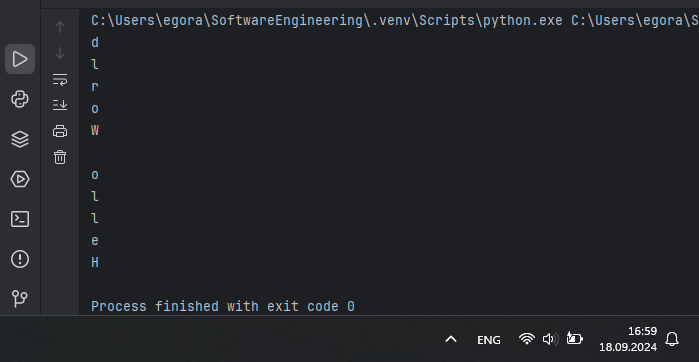

## Выводы

В данном коде строка line выводится в обратном порядке отдельно по 1 букве в строке. Это достигается за счет того, что цикл начинается с числа, равного длине строки - 1 (это индекс последнего символа) и идет до -1 невключительно (до 0 - индекс первого символа) с шагом -1, т.е. цикл работает в обратном порядке.

## Самостоятельная работа №3
### Напишите программу, на вход которой поступает значение из консоли, оно должно быть числовым и в диапазоне от 0 до 10 включительно (это необходимо учесть в программе). Если вводимое число не подходит по требованиям, то необходимо вывести оповещение об этом в консоль и остановить программу. Код должен вычислять в каком диапазоне находится полученное число. Нужно учитывать три диапазона:

•	от 0 до 3 включительно

•	от 3 до 6

•	от 6 до 10 включительно

Результатом работы программы будет выведенный в консоль диапазон. Программа должна занимать не более 10 строчек в редакторе кода.

```python
num = int(input("Введите число в диапазоне от 0 до 10 включительно: "))
if 0 <= num <= 10:
    if 0 <= num <= 3:
        print("от 0 до 3 включительно")
    elif 3 < num < 6:
        print("от 3 до 6")
    elif 6 <= num <= 10:
        print("от 6 до 10 включительно")
else:
    print('Число не подходит по требованиям')
```
### Результат.
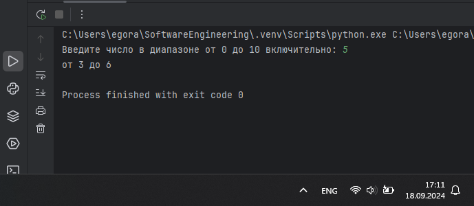

## Выводы

В данном коде 

## Самостоятельная работа №4
### Манипулирование строками. Напишите программу на Python, которая принимает предложение (на английском) в качестве входных данных от пользователя. Выполните следующие операции и отобразите результаты:

•	Выведите длину предложения.

•	Переведите предложение в нижний регистр.

•	Подсчитайте количество гласных (a, e, i, o, u) в предложении.

•	Замените все слова "ugly" на "beauty".

•	Проверьте, начинается ли предложение с "The" и заканчивается ли на "end".

Проверьте работу программы минимум на 3 предложениях, чтобы охватить проверку всех поставленных условий.

```python
line = input('Введите предложение: ')

print('Длина предложения:', len(line))

lineLower = line.lower()
print ('Предложение в нижнем регистре:', lineLower)

letters = 'aeiouy'
count = 0
for letter in lineLower:
    if letter in letters:
        count += 1
print('Количество гласных букв в предложении:', count)

print('Измененное предложение с заменой ugly на beauty:', line.replace('ugly', 'beauty'))

if (line.startswith('The') and line.endswith('end')):
    print('Предложение начинается с "The" и заканчивается на "end"')
else:
    print('Предложение не начинается с "The" и не заканчивается на "end" одновременно')
```
### Результат.
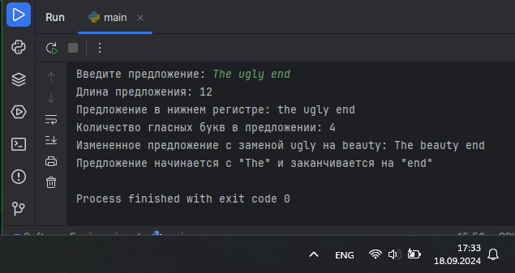

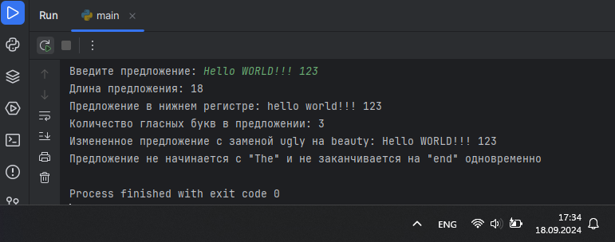

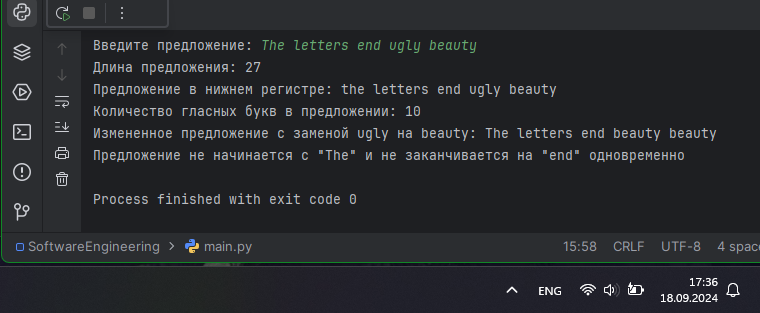

## Выводы

В данном коде идет работа со строковой переменной line, которую вводит пользователь: 1) подсчитывается количество символов с помощью len(); 2) предложение переводится в нижний регистр с помощью lower(); 3) подсчитывается количество гласных букв в слове с помощью цикла for и условия нахождения гласной буквы в предложении; 4) все слова 'ugly' заменяются на 'beauty' с помощью replace(); 5) проверяется, начинается ли предложение на 'The' с помощью startswith() и заканчивается ли на 'end' с помощью endswith().

## Самостоятельная работа №5
### Составьте программу, результатом которой будет данный вывод в консоль:

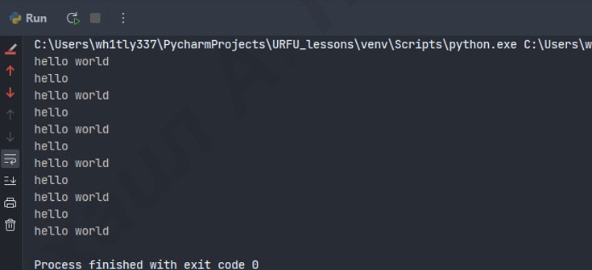

Программу нужно составить из данных фрагментов кода:

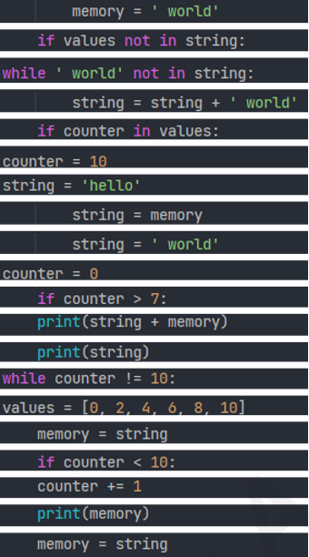

Строки кода можно использовать только один раз. Не обязательно использовать все строки кода.

```python
string = 'hello'
values = [0, 2, 4, 6, 8, 10]
counter = 0
while ' world' not in string:
    memory = string
    if counter in values:
        string = string + ' world'
    print(string)
    if counter < 10:
        string = memory
    counter += 1
```
### Результат.
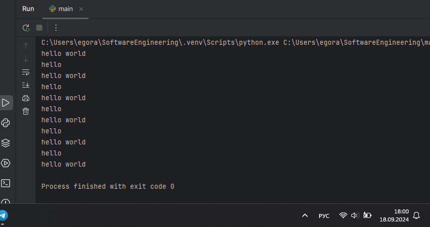

## Выводы

В данном коде цикл while продолжает свою работу до тех пор, пока строка ' world' отсутствует в переменной string. Изначально переменная string равна 'hello'. В цикле каждый раз проверяется, есть ли значение переменной counter в списке values. Сам список содержит четные цифры от 0 до 10, а переменная counter изначально равна 0. Если значение переменной counter все же есть в списке, то к переменной string добавляется строка ' world', в итоге выводится 'hello world'. Если counter меньше 10, то переменной string снова присваивается первоначальное значение 'hello', а счетчик counter прибавляется на 1. Таким образом, в values перечислены все итерацииц цикла, при которых выведется 'hello world' (четные цифры). При нечетных будет выводиться просто 'hello'. Когда counter будет равна 10, обновление переменной string прекратится, из-за чего цикл завершится.

## Общие выводы по теме
В Python существуют различные операторы: арифметические операторы, операторы сравнения, операторы присваивания, логические операторы, операторы принадлежности и т.д. Все они важны и используются в программах повсеместно. Условные конструкции так же полезны, ведь они позволяют выполнять различные действия в зависимости от условия. Они основаны на ключевых словах if, else, elif. Для повторяющихся операций удобно использовать циклы - for и while, которые также могут быть и вложенными.
