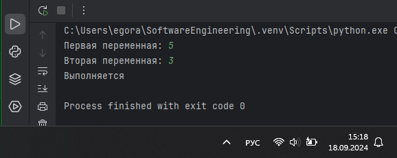

# Тема 3. Операторы, условия, циклы
Отчет по Теме #3 выполнил(а):
- Аверкиев Егор Алексеевич
- ИВТ-22-1

| Задание | Лаб_раб | Сам_раб |
| ------ | ------ | ------ |
| Задание 1 | + | + |
| Задание 2 | + | + |
| Задание 3 | + | + |
| Задание 4 | + | + |
| Задание 5 | + | + |
| Задание 6 | + |  |
| Задание 7 | + |  |
| Задание 8 | + |  |
| Задание 9 | + |  |
| Задание 10 | + |  |

знак "+" - задание выполнено; знак "-" - задание не выполнено;

Работу проверили:
- к.э.н., доцент Панов М.А.

## Лабораторная работа №1
### Создайте две переменные, значение которых будете вводить через консоль. Также составьте условие, в котором созданные ранее переменные будут сравниваться, если условие выполняется, то выведете в консоль «Выполняется», если нет, то «Не выполняется».

```python
print(123)
print('123')
print(1.23)
```
### Результат.


## Выводы

В данном коде выводятся три строки с использованием функции `print()`. Первая строка выводит целое число 123, вторая строка выводит строку '123' (уже в виде текстовой строки, а не числа), а третья строка выводит число 1.23 с плавающей точкой (в виде числа, как и в 1 случае).

## Лабораторная работа №2
### Напишите программу, которая будет определять значения переменной меньше 0, больше 0 и меньше 10 или больше 10. Это нужно реализовать при помощи одной переменной, значение которой будет вводится через консоль, а также при помощи конструкций if, elif, else.

```python

```
### Результат.


## Выводы

В данном коде 

## Лабораторная работа №3
### Напишите программу, в которой будет проверяться есть ли переменная в указанном массиве используя логический оператор in. Самостоятельно посмотрите, как работает программа со значениями которых нет в массиве numbers.

```python

```
### Результат.


## Выводы

В данном коде 

## Лабораторная работа №4
### Напишите программу, которая будет определять находится ли переменная в указанном массиве и если да, то проверьте четная она или нет. Самостоятельно протестируйте данную программу с разными значениями переменной value. 

```python

```
### Результат.


## Выводы

В данном коде 

## Лабораторная работа №5
### Напишите программу, в которой циклом for значения переменной i будут меняться от 0 до 10 и посмотрите, как разные виды сравнений и операций работают в цикле.

```python

```
### Результат.


## Выводы

В данном коде 

## Лабораторная работа №6
### Напишите программу, в которой при помощи цикла for определяется есть ли переменная value в строке string и посмотрите, как работает оператор else для циклов. Самостоятельно посмотрите, что выведет программа, если значение переменной value оказалось в строке string. 

```python

```
### Результат.


## Выводы

В данном коде 

## Лабораторная работа №7
### Напишите программу, в которой вы наглядно посмотрите, как работает цикл for проходя в обратном порядке, то есть, к примеру не от 0 до 10, а от 10 до 0. В уже готовой программе показано вычитание из 100, а вам во время реализации программы будет необходимо придумать свой вариант применения обратного цикла.

```python

```
### Результат.


## Выводы

В данном коде 

## Лабораторная работа №8
### Напишите программу используя цикл while, внутри которого есть какие-либо проверки, но быть осторожным, поскольку циклы while при неправильно написанных условиях могут становится бесконечными, как указано в примере далее.

```python

```
### Результат.


## Выводы

В данном коде 

## Лабораторная работа №9
### Напишите программу с использованием вложенных циклов и одной проверкой внутри них. Самое главное, не забудьте, что нельзя использовать одинаковые имена итерируемых переменных, когда вы используете вложенные циклы.

```python

```
### Результат.


## Выводы

В данном коде 

## Лабораторная работа №10
### Напишите программу с использованием flag, которое будет определять есть ли нечетное число в массиве. В данной задаче flag выступает в роли индикатора встречи нечетного числа в исходном массиве, четных чисел.

```python

```
### Результат.


## Выводы

В данном коде 

## Самостоятельная работа №1
### Напишите программу, которая преобразует 1 в 31.
Для выполнения поставленной задачи необходимо обязательно и только один раз использовать:
•	Цикл for
•	*= 5
•	+= 1
Никаких других действий или циклов использовать нельзя.

```python

```
### Результат.


## Выводы

В данном коде 

## Самостоятельная работа №2
### Напишите программу, которая фразу «Hello World» выводит в обратном порядке, и каждая буква находится в одной строке консоли. При этом необходимо обязательно использовать любой цикл, а также программа должна занимать не более 3 строк в редакторе кода.

```python

```
### Результат.


## Выводы

В данном коде 

## Самостоятельная работа №3
### Напишите программу, на вход которой поступает значение из консоли, оно должно быть числовым и в диапазоне от 0 до 10 включительно (это необходимо учесть в программе). Если вводимое число не подходит по требованиям, то необходимо вывести оповещение об этом в консоль и остановить программу. Код должен вычислять в каком диапазоне находится полученное число. Нужно учитывать три диапазона:
•	от 0 до 3 включительно
•	от 3 до 6
•	от 6 до 10 включительно
Результатом работы программы будет выведенный в консоль диапазон. Программа должна занимать не более 10 строчек в редакторе кода.

```python

```
### Результат.


## Выводы

В данном коде 

## Самостоятельная работа №4
### Манипулирование строками. Напишите программу на Python, которая принимает предложение (на английском) в качестве входных данных от пользователя. Выполните следующие операции и отобразите результаты:
•	Выведите длину предложения.
•	Переведите предложение в нижний регистр.
•	Подсчитайте количество гласных (a, e, i, o, u) в предложении.
•	Замените все слова "ugly" на "beauty".
•	Проверьте, начинается ли предложение с "The" и заканчивается ли на "end".
Проверьте работу программы минимум на 3 предложениях, чтобы охватить проверку всех поставленных условий.

```python

```
### Результат.


## Выводы

В данном коде 

## Самостоятельная работа №5
### Составьте программу, результатом которой будет данный вывод в консоль:

Программу нужно составить из данных фрагментов кода:

Строки кода можно использовать только один раз. Не обязательно использовать все строки кода.

```python

```
### Результат.


## Выводы

В данном коде 

## Общие выводы по теме
- Развернутый вывод
