# Тема 4. Функции и стандартные модули/библиотеки
Отчет по Теме #4 выполнил(а):
- Аверкиев Егор Алексеевич
- ИВТ-22-1

| Задание | Лаб_раб | Сам_раб |
| ------ | ------ | ------ |
| Задание 1 | + | + |
| Задание 2 | + | + |
| Задание 3 | + | + |
| Задание 4 | + | + |
| Задание 5 | + | + |
| Задание 6 | + |  |
| Задание 7 | + |  |
| Задание 8 | + |  |
| Задание 9 | + |  |
| Задание 10 | + |  |

знак "+" - задание выполнено; знак "-" - задание не выполнено;

Работу проверили:
- к.э.н., доцент Панов М.А.

## Лабораторная работа №1
### Напишите функцию, которая выполняет любые арифметические действия и выводит результат в консоль. Вызовите функцию используя “точку входа”.

```python
def main():
    print(1+2)
if __name__ == '__main__':
    main()
```
### Результат.
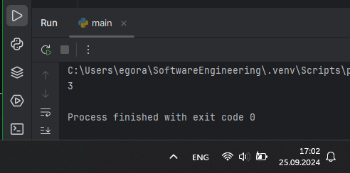

## Выводы

В данном коде с помощью "точки входа", равной '__main__' вызывается функция main(), которая выводит результат выполнения операции 1+2.

## Лабораторная работа №2
### Напишите функцию, которая выполняет любые арифметические действия, возвращает при помощи return значение в место, откуда вызывали функцию. Выведите результат в консоль. Вызовите функцию используя “точку входа”.

```python
def main():
    return 2+2
if __name__ == '__main__':
    print(main())
```
### Результат.
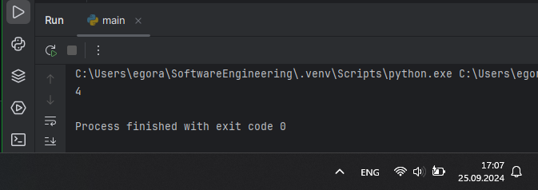

## Выводы

В данном коде с помощью "точки входа" '__main__' вызывается функция main(), которая возвращает результат операции 2+2 в эту же точку входа, откуда она была вызвана.

## Лабораторная работа №3
### Напишите функцию, в которую передаются два аргумента, над ними производится арифметическое действие, результат возвращается туда, откуда эту функцию вызывали. Выведите результат в консоль. Вызовите функцию в любом небольшом цикле.

```python
def main(one, two):
    result = one * two
    return result

for i in range(3):
    x = 3
    y = 5
    answer = main(x, y)
    print(answer)
```
### Результат.
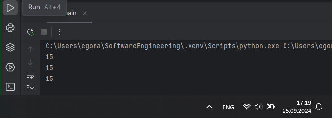

## Выводы

В данном коде в цикле 3 раза вызывается функция main(one, two), имеющая 2 параметра. Она возвращает результат умножения первого пераданного в качестве аргумента числа на второе переданное число. Поскольку цикл имеет 3 итерации, то в консоль выведется 3 раза получившееся число 15.

## Лабораторная работа №4
### Напишите функцию, на вход которой подается какое-то изначальное неизвестное количество аргументов, над которыми будет производится арифметические действия. Для выполнения задания необходимо использовать кортеж “*args”. 

```python
def main(x, *args):
    one = x
    two = sum(args)
    three = float(len(args))

    print(f"one={one}\ntwo={two}\nthree={three}")

    return x + sum(args) / float(len(args))

if __name__ == '__main__':
    result = main(10, 0, 3, 4, -1, 5, -1, 0, 1)
    print(f"\nresult={result}")
```
### Результат.
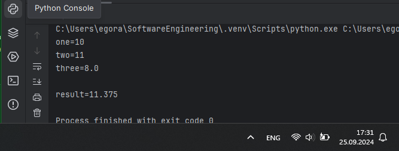

## Выводы

В данном коде с помощью точки входа вызывается функция main, которой в качестве параметров имеет переменную x и кортеж аргументов *args. Внутри функции переменной one присваивается значение x, переменной two - сумма переданных аргументов args, переменной three вещественное значение длины args. Функция возвращает результат операций one + two / three.

## Лабораторная работа №5
### Напишите функцию, которая на вход получает кортеж “**kwargs” и при помощи цикла выводит значения, поступившие в функцию. На скриншоте ниже указаны два варианта вызова функции с “**kwargs” и два варианта работы с данными, поступившими в эту функцию. Комментарии в коде и теоретическая часть помогут вам разобраться в этом нелегком аспекте. Вызовите функцию используя “точку входа”.

```python
def main(**kwargs):
    for i in kwargs.items():
        print(i[0], i[1])

    print()

    for key in kwargs:
        print(f"{key} = {kwargs[key]}")

if __name__ == '__main__':
    main(x=[1, 2, 3], y=[3, 3, 0], z =[2, 3, 0], q=[3, 3, 0], w=[3, 3, 0])
    print()
    main(**{'x': [1, 2, 3], 'y': [3, 3, 0]})
```
### Результат.
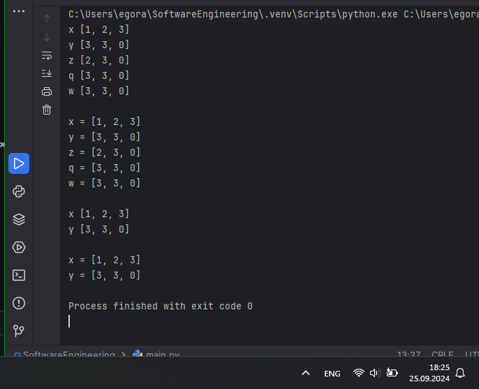

## Выводы

В данном коде функция main с помощью циклов выводит переданные ей значения в виде кортежа **kwargs. В результате функция выводит в консоль ключи и соответствующие значения в двух форматах.

## Лабораторная работа №6
### Напишите две функции. Первая – получает в виде параметра “**kwargs”. Вторая считает среднее арифметическое из значений первой функции. Вызовите первую функцию используя “точку входа” и минимум 4 аргумента.

```python
def main(**kwargs):
    for i, j in kwargs.items():
        print(f"{i}. Значение = {mean(j)}")

def mean(data):
    return sum(data) / float(len(data))

if __name__ == '__main__':
    main(x=[1, 2, 3, 2], y=[3, 3, 0, 3], z=[2, 4, 4, 0], k=[4, 3, 5, 1])
```
### Результат.
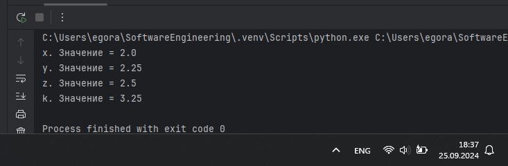

## Выводы

В данном коде функция main имеет параметр **kwargs. В теле этой функции определяется значение каждого аргумента с помощью функции mean(data), которая вычисляет среднее арифметическое из переданных значений первой функции. Этот результат для каждого аргумента выводится в консоль.

## Лабораторная работа №7
### Создайте дополнительный файл .py. Напишите в нем любую функцию, которая будет что угодно выводить в консоль, но не вызывайте ее в нем. Откройте файл main.py, импортируйте в него функцию из нового файла и при помощи “точки входа” вызовите эту функцию.

```python
def hello():
    print('Hello world')


from for_import import hello
if __name__ == '__main__':
    hello()
```
### Результат.
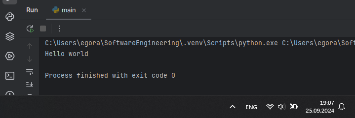

## Выводы

В данном коде в файл main.py импортируется функция hello() из файла for_import.py. Затем при помощи "точки входа" вызывается эта импортированная функция, а ее результат выводится в консоль.

## Лабораторная работа №8
### Напишите программу, которая будет выводить корень, синус, косинус полученного от пользователя числа.

```python
import math
def main():
    value = int(input('Введите значение: '))
    print(math.sqrt(value))
    print(math.sin(value))
    print(math.cos(value))
    
if __name__ == '__main__':
    main()
```
### Результат.
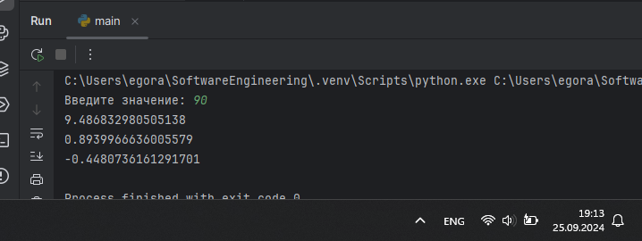

## Выводы

В данном коде импортируется библиотека math. Затем пользователь вводит целочисленное значение, в результате чего на экран выводится корень, синус и косинус этого числа с помощью функций из импортированной библиотеки math.

## Лабораторная работа №9
### Напишите программу, которая будет рассчитывать какой день недели будет через n-нное количество дней, которые укажет пользователь.

```python
from datetime import datetime as dt
from datetime import timedelta as td
def main():
    print(
        f"Сегодня {dt.today().date()}. "
        f"День недели - {dt.today().isoweekday()}"
    )
    n = int(input('Введите количество дней: '))
    today = dt.today()
    result = today + td(days=n)
    print(
        f"Через {n} дней будет {result.date()}. "
        f"День недели - {result.isoweekday()}"
    )

if __name__ == '__main__':
    main()
```
### Результат.
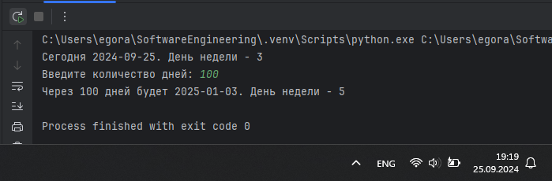

## Выводы

В данном коде сначала импортируются функции из библиотеки datetime, которые переименовываются в dt и td и затем используются в коде. Далее - выводится текущая дата и день недели. Пользователь вводит нужное ему количество дней, после чего определяется какая дата и день недели будут через это количество дней.

## Лабораторная работа №10
### Напишите программу с использованием глобальных переменных, которая будет считать площадь треугольника или прямоугольника в зависимости от того, что выберет пользователь. Получение всей необходимой информации реализовать через input(), а подсчет площадей выполнить при помощи функций. Результатом программы будет число, равное площади, необходимой фигуры.

```python
global result

def rectangle():
    a = float(input("Ширина: "))
    b = float(input("Высота: "))
    global result
    result = a * b

def triangle():
    a = float(input("Основание: "))
    h = float(input("Высота: "))
    global result
    result = 0.5 * a * h

figure = input("1 - прямоугольник, 2 - треугольник: ")
if figure == '1':
    rectangle()
if figure == '2':
    triangle()

print(f"Площадь: {result}")
```
### Результат.
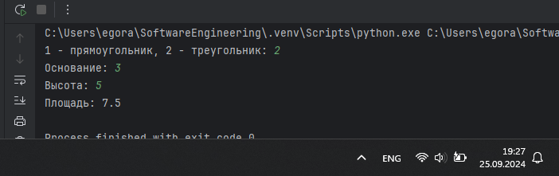

## Выводы

В данном коде сначала объявляется глобальная переменная result и описываются функции rectangle() и triangle(). В зависимости от того, какую цифру введет пользователь (1 или 2), вызовется соответствующая функция. От пользователя также дополнительно потребуется ввести нужные для расчета площади параметры фигуры, после чего выведется посчитанная площадь фигуры.

## Самостоятельная работа №1
### Дайте подробный комментарий для кода, написанного ниже. Комментарий нужен для каждой строчки кода, нужно описать что она делает. Не забудьте, что функции комментируются по-особенному.
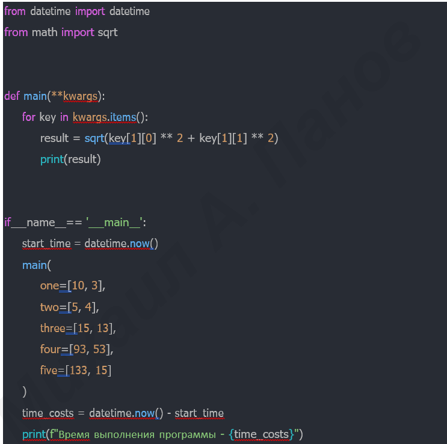

```python
#Импорт класса datetime из библиотеки datetime
from datetime import datetime
#Импорт функции sqrt из библиотеки math
from math import sqrt

#Функция, принимающая любое количество аргументов в виде словаря
def main(**kwargs):
    """
    Вычисляет длину вектора по теореме Пифагора
    Параметры:
        **kwargs (словарь) - элементы со значениями начала и конца вектора
    Возвращает:
        float: длина вектора
    """
    #Проходимся по элементам kwargs с ключом key
    for key in kwargs.items():
        #Вычисление длины вектора по теореме Пифагора 
        result = sqrt(key[1][0] ** 2 + key[1][1] ** 2)
        #Вывод посчитанного результата
        print(result)
        
#Проверка "точки входа"
if __name__ == '__main__':
    #Запоминается начальное время перед началом вызова функции main
    start_time = datetime.now()
    #Вызов функции main, куда передаются наборы из 2 значений - списки
    main(
        one = [10, 3],
        two = [5, 4],
        three = [15, 13],
        four = [93, 53],
        five = [133, 15]
    )
    #Вычисляется время выполнения программы, т.е. из текущего вычитается зафиксированное
    time_costs = datetime.now() - start_time
    #Выводится время выполнения программы - значение time_costs
    print(f"Время выполнения программы - {time_costs}")
```
### Результат.
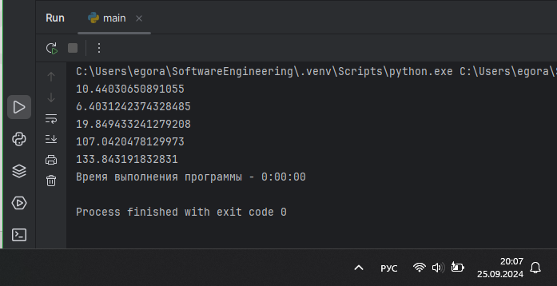

## Выводы

В данном коде функции main() передаются наборы значений, составляющие в итоге словарь. По этим наборам значений вычисляются и выводятся длины векторов. В консоль также выводится время выполнения программы, которое начинает считаться перед вызовом функции main().

## Самостоятельная работа №2
### Напишите программу, которая будет заменять игральную кость с 6 гранями. Если значение равно 5 или 6, то в консоль выводится «Вы победили», если значения 3 или 4, то вы рекурсивно должны вызвать эту же функцию, если значение 1 или 2, то в консоль выводится «Вы проиграли». При этом каждый вызов функции необходимо выводить в консоль значение “кубика”. Для выполнения задания необходимо использовать стандартную библиотеку random. Программу нужно написать, используя одну функцию и “точку входа”

```python
import random
def randomcube():
    value = random.randint(1, 6)
    print(f"Значение кубика: {value}")
    if value == 5 or value == 6:
        print("Вы победили")
    elif value == 3 or value == 4:
        randomcube()
    else:
        print("Вы проиграли")
if __name__ == '__main__':
    randomcube()
```
### Результат.
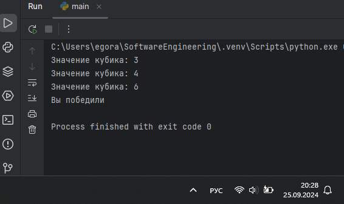

## Выводы

В данном коде с помощью "точки входа" вызывается функция randomcube(), в которой переменной value присваивается рандомное значение в диапазоне от 1 до 6 включительно с использованием библиотеки random. В консоль выводится значение кубика, т.е. значение переменной value. Если значение равно 5 или 6, то выводится сообщение "Вы победили", если 3 или 4 - функция вызывается снова, в ином случае - выводится сообщение "Вы проиграли".

## Самостоятельная работа №3
### Напишите программу, которая будет выводить текущее время, с точностью до секунд на протяжении 5 секунд. Программу нужно написать с использованием цикла. Подсказка: необходимо использовать модуль datetime и time, а также вам необходимо как-то “усыплять” программу на 1 секунду.

```python
import datetime as dt, time
def funct():
    for i in range(5):
        currentTime = dt.datetime.now()
        print(currentTime.strftime("%H:%M:%S"))
        time.sleep(1)
if __name__ == '__main__':
    funct()
```
### Результат.
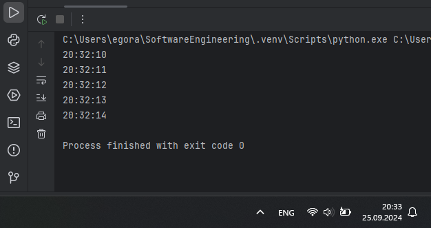

## Выводы

В данном коде импортируются и далее используются библиотеки datetime (как dt) и time. С помощью "точки входа" вызывается функция funct(), в которой цикл прорабатывает 5 раз. Каждый раз он выводит текущее время в определенном формате и на секунду приостанавливает работу.

## Самостоятельная работа №4
### Напишите программу, которая считает среднее арифметическое от аргументов вызываемое функции, с условием того, что изначальное количество этих аргументов неизвестно. Программу необходимо реализовать используя одну функцию и “точку входа”.

```python
def funct(*args):
    if len(args) == 0:
        return 0
    return sum(args) / len(args)
if __name__ == '__main__':
    result = funct(10, 20, 30, 20)
    print(f"Среднее арифметическое = {result}")
```
### Результат.
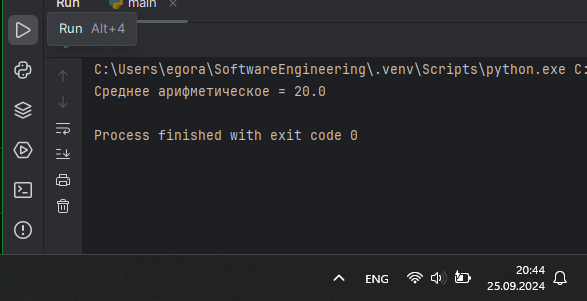

## Выводы

В данном коде с помощью "точки входа" вызывается функция funct с различным числом аргументов (в данном случае 4). Если число аргументов = 0, то возвращается 0. В ином случае функция возвращает сумму аргументов, разделенную на их количество, т.е. среднее арифметическое. Результат присваивается переменной result и выводится в консоль.

## Самостоятельная работа №5
### Создайте два Python файла, в одном будет выполняться вычисление площади треугольника при помощи формулы Герона (необходимо реализовать через функцию), а во втором будет происходить взаимодействие с пользователем (получение всей необходимой информации и вывод результатов). Напишите эту программу и выведите в консоль полученную площадь.

```python
import math
def func(a, b, c):
    p = (a+b+c)/2
    result = math.sqrt(p*(p-a)*(p-b)*(p-c))
    return result

from Square import func
print("Введите длины сторон треугольника: ")
a = float(input("a: "))
b = float(input("b: "))
c = float(input("c: "))
result = func(a, b, c)
print(f"Площадь треугольника = {result}")
```
### Результат.
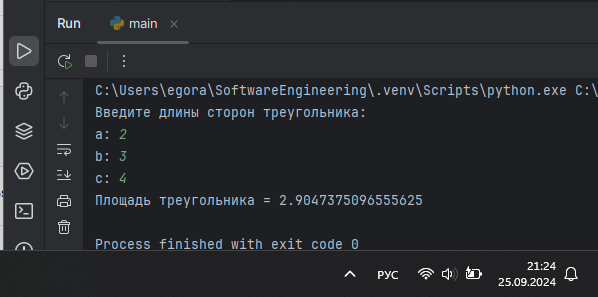

## Выводы

В данном коде в основной модуль импортируется самописная функция func из файла Square.py для вычисления площади треугольникам по формуле Герона. Пользователь вводит последовательно 3 стороны треугольника, после чего вызывается импортированная функция для вычисления площади треугольника. Результат выводится в консоль.

## Общие выводы по теме
- Функции являются крайне полезным инструментом для программиста, поскольку они позволяют группировать повторяющийся код, что делает программу более организованной. Существуют различные готовые функции, которые можно импортировать из библиотек, либо же можно написать самому под необходимую задачу. У функций можно указывать различные параметры: как строго указанное количество, так и неопределенное количество, а некоторые можно и вовсе сделать необязательными. Важно учитывать это при написании собственной функции.
