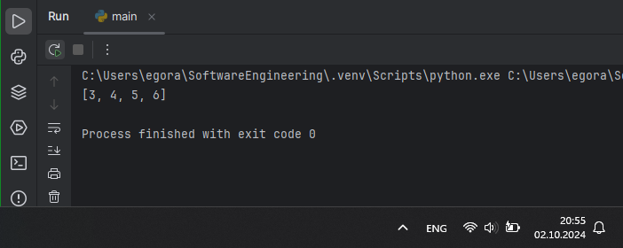
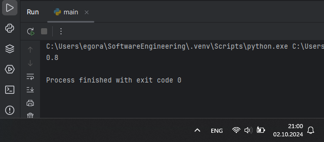

# Тема 5. Базовые коллекции: строки и списки
Отчет по Теме #5 выполнил(а):
- Аверкиев Егор Алексеевич
- ИВТ-22-1

| Задание | Лаб_раб | Сам_раб |
| ------ | ------ | ------ |
| Задание 1 | + | + |
| Задание 2 | + | + |
| Задание 3 | + | + |
| Задание 4 | + | + |
| Задание 5 | + | + |
| Задание 6 | + |  |
| Задание 7 | + |  |
| Задание 8 | + |  |
| Задание 9 | + |  |
| Задание 10 | + |  |

знак "+" - задание выполнено; знак "-" - задание не выполнено;

Работу проверили:
- к.э.н., доцент Панов М.А.

## Лабораторная работа №1
### Друзья предложили вам поиграть в игру “найди отличия и убери повторения (версия для программистов)”. Суть игры состоит в том, что на вход программы поступает два множества, а ваша задача вывести все элементы первого, которых нет во втором. А вы как раз недавно прошли множества и знаете их возможности, поэтому это не составит для вас труда.

```python
set1 = {'white', 'black', 'red', 'pink'}
set2 = {'red', 'green', 'blue', 'red'}
print(set1 - set2)
```
### Результат.


## Выводы

В данном коде множество set2 вычитается из множества set1, в результате чего на экран выводятся элементы множества set1, которых нет в set2.

## Лабораторная работа №2
### Напишите две одинаковые программы, только одна будет использовать set(), а вторая frozenset() и попробуйте к исходному множеству добавить несколько элементов, например, через цикл.

```python
a = set('abcdefg')
print(a)
for i in range(1, 5):
    a.add(i)
print(a)

b = frozenset('abcdefg')
print(b)
for i in range(1, 5):
    b.add(i)
print(b)
```
### Результат.


## Выводы

В данном коде продемонстрировано, что в обычное множество set() можно добавлять элементы, а в неизменяемое множество frozenset() - нельзя (будет ошибка).

## Лабораторная работа №3
### На вход в программу поступает список (минимальной длиной 2 символа). Напишите программу, которая будет менять первый и последний элемент списка.

```python
def replace(inputList):
    memory = inputList[0]
    inputList[0] = inputList[-1]
    inputList[-1] = memory
    return inputList

print(replace([1, 2, 3, 4 ,5]))
```
### Результат.


## Выводы

В данном коде функции replace подается список. Во временной переменной сохраняется ее первый элемент, затем первому элементу присваивается значение последнего, а последнему - значение временной переменной. В результате возвращается список, у которого первый и последний элементы поменялись местами.

## Лабораторная работа №4
### На вход в программу поступает список (минимальной длиной 10 символов). Напишите программу, которая выводит элементы с индексами от 2 до 6. В программе необходимо использовать “срез”.

```python
a = [1, 2, 3, 4, 5, 6, 7, 8, 9, 10, 11, 12]
print(a[2:6])
```
### Результат.


## Выводы

В данном коде для вывода части списка использется срез для вывода всех элементов со 2 индекса по 6 (невключительно).

## Лабораторная работа №5
### Иван задумался о поиске «бесполезного» числа, полученного из списка. Суть поиска в следующем: он берет произвольный список чисел, находит самое большое из них, а затем делит его на длину списка. Студент пока не придумал, где может пригодиться подобное значение, но ищет у вас помощи в реализации такой функции useless().

```python
def useless(lst):
    return max(lst) / len(lst)
print(useless([1, 2, 3, 4, 8, 3, 5, 6, 2, 3]))
```
### Результат.


## Выводы

В данном коде используется функция useless(), которая принимает список и возвращает значение, полученное в результате деления максимального элемента в списке на количество элементов в этом списке.

## Лабораторная работа №6
### Ребята не могут определится каким супергероем они хотят стать. У них есть случайно составленный список супергероев, и вы должны определить кто из ребят будет каким супергероем. Необходимо использовать разделение списков.

```python
superheroes = ['spiderman', 'batman', 'superman']
Nikolay, Vasiliy, Ivan = superheroes
print('Николай - ', Nikolay)
print('Василий - ', Vasiliy)
print('Иван - ', Ivan)
```
### Результат.


## Выводы

В данном коде переменным Nikolay, Vasiliy и Ivan присваиваются значения элементов списка superheroes и затем выводятся на экран.

## Лабораторная работа №7
### Вовочка, насмотревшись передачи “Слабое звено” решил написать программу, которая также будет находить самое слабое звено (минимальный элемент) и удалять его, только делать он это хочет не с людьми, а со списком. Помогите Вовочке с реализацией программы. Подсказка: для этого вам необходимо отсортировать список и удалить значение при помощи pop().

```python
lst = [1, 42, -32, 33, 10, -5]
lst.sort()
print("Отсортированный список: \n", lst)
lst.pop(0)
print("Список без слабого звена: \n", lst)
```
### Результат.


## Выводы

В данном коде происходит сортировка списка, а затем удаление самого первого элемента (т.е. наименьшего после сортировки) и вывод списка на экран.

## Лабораторная работа №8
### Михаил решил создать большой n-мерный список, для этого он случайным образом создал несколько списков, состоящих минимум из 3, а максимум из 10 элементов и поместил их в один большой список. Он также как и Иван не знает зачем ему это сейчас нужно, но надеется на то, что это пригодится ему в будущем.

```python
from random import randint
def list_maker():
    lst = [randint(1, 100)] * randint(3, 10)
    return lst

if __name__ == '__main__':
    result = []
    for i in range(randint(1, 5)):
        result.append(list_maker())
    print(result)
```
### Результат.


## Выводы

В данном коде с помощью функции list_maker() создаются несколько списков из 3-10 элементов. Затем все созданные списки добавляются в один единый список - result, элементы которого выводятся на экран.

## Лабораторная работа №9
### Вы работаете в ресторане и отвечает за статистику покупок, ваша задача сравнить между собой заказы покупателей, которые указаны в разном порядке. Реализуйте функцию superset(), которая принимает 2 множества. Результат работы функции: вывод в консоль одного из сообщений в зависимости от ситуации:

1	- «Супермножество не обнаружено»

2	– «Объект {X} является чистым супермножеством»

3 – «Множества равны»

```python
def superset(set_1, set_2):
    if set_1 > set_2:
        print(f"Объект {set_1} является чистым супермножеством")
    elif set_1 == set_2:
        print(f"Множества равны")
    elif set_1 < set_2:
        print(f"Объект {set_2} является чистым супермножеством")
    else:
        print("Супермножество не обнаружено")
if __name__ == '__main__':
    superset({1, 8, 3, 5}, {3, 5})
    superset({1, 8, 3, 5}, {5, 3, 8, 1})
```
### Результат.


## Выводы

В данном коде в функции superset() сравниваются два множества set_1 и set_2 и выводится соответствующее сообщение.

## Лабораторная работа №10
### Предположим, что вам нужно разобрать стопку бумаг, но нужно начать работу с нижней, “переверните стопку”. Вам дан произвольный список. Представьте его в обратном порядке. Программа должна занимать не более двух строк в редакторе кода.

```python
lst = [1, 3, 5, 7]
print(lst[::-1])
```
### Результат.


## Выводы

В данном коде с помощью среза элементы списка переставляются в обратном порядке и затем выводятся на экран.

## Самостоятельная работа №1
### Ресторан на предприятии ведет учет посещений за неделю при помощи кода работника. У них есть список со всеми посещениями за неделю. Ваша задача почитать:
•	Сколько было выдано чеков
•	Сколько разных людей посетило ресторан
•	Какой работник посетил ресторан больше всех раз

Список выданных чеков за неделю:

[8734, 2345, 8201, 6621, 9999, 1234, 5678, 8201, 8888, 4321, 3365,

1478, 9865, 5555, 7777, 9998, 1111, 2222, 3333, 4444, 5556, 6666,

5410, 7778, 8889, 4445, 1439, 9604, 8201, 3365, 7502, 3016, 4928,

5837, 8201, 2643, 5017, 9682, 8530, 3250, 7193, 9051, 4506, 1987,

3365, 5410, 7168, 7777, 9865, 5678, 8201, 4445, 3016, 4506, 4506]

Результатом выполнения задачи будет: листинг кода, и вывод в консоль, в котором будет указана вся необходимая информация.

```python
checks = [
    8734, 2345, 8201, 6621, 9999, 1234, 5678, 8201, 8888, 4321, 3365,
    1478, 9865, 5555, 7777, 9998, 1111, 2222, 3333, 4444, 5556, 6666,
    5410, 7778, 8889, 4445, 1439, 9604, 8201, 3365, 7502, 3016, 4928,
    5837, 8201, 2643, 5017, 9682, 8530, 3250, 7193, 9051, 4506, 1987,
    3365, 5410, 7168, 7777, 9865, 5678, 8201, 4445, 3016, 4506, 4506
]
summa = len(checks)
people = len(set(checks))
biggest = max(set(checks), key = checks.count)
print(f"Всего чеков: {summa}")
print(f"Людей посетило ресторан: {people}")
print(f"Больше всех раз посетил ресторан работник {biggest}")
```
### Результат.


## Выводы

В данном коде вычисляется: 1) количество элементов в списке; 2) количество элементов во множестве; 3) наиболее часто встречающийся элемент в множестве. Результаты выводятся в консоль.

## Самостоятельная работа №2
### На физкультуре студенты сдавали бег, у преподавателя физкультуры есть список всех результатов, ему нужно узнать
•	Три лучшие результата
•	Три худшие результата
•	Все результаты начиная с 10 Ваша задача помочь ему в этом.

Список результатов бега:

[10.2, 14.8, 19.3, 22.7, 12.5, 33.1, 38.9, 21.6, 26.4, 17.1, 30.2, 35.7, 16.9, 27.8, 24.5, 16.3, 18.7, 31.9, 12.9, 37.4]

Результатом выполнения задачи будет: листинг кода, и вывод в консоль, в котором будет указана вся необходимая информация.

```python

```
### Результат.


## Выводы

В данном коде 

## Самостоятельная работа №3
### Преподаватель по математике придумал странную задачку. У вас есть три списка с элементами, каждый элемент которых – длина стороны треугольника, ваша задача найти площади двух треугольников, составленные из максимальных и минимальных элементов полученных списков. Результатом выполнения задачи будет: листинг кода, и вывод в консоль, в котором будут указаны два этих значения.

Три списка:

one = [12, 25, 3, 48, 71]

two = [5, 18, 40, 62, 98]

three = [4, 21, 37, 56, 84]

```python

```
### Результат.


## Выводы

В данном коде 

## Самостоятельная работа №4
### Никто не любит получать плохие оценки, поэтому Борис решил это исправить. Допустим, что все оценки студента за семестр хранятся в одном списке. Ваша задача удалить из этого списка все двойки, а все тройки заменить на четверки.

Списки оценок (проверить работу программы на всех трех вариантах): 

[2, 3, 4, 5, 3, 4, 5, 2, 2, 5, 3, 4, 3, 5, 4]

[4, 2, 3, 5, 3, 5, 4, 2, 2, 5, 4, 3, 5, 3, 4]

[5, 4, 3, 3, 4, 3, 3, 5, 5, 3, 3, 3, 3, 4, 4]

Результатом выполнения задачи будет: листинг кода, и вывод в консоль, в котором будут три обновленных массива.

```python

```
### Результат.


## Выводы

В данном коде 

## Самостоятельная работа №5
### Вам предоставлены списки натуральных чисел, из них необходимо сформировать множества. При этом следует соблюдать это правило: если какое-либо число повторяется, то преобразовать его в строку по следующему образцу: например, если число 4 повторяется 3 раза, то в множестве будет следующая запись: само число 4, строка «44», строка «444».

Множества для теста:

list_1 = [1, 1, 3, 3, 1]

list_2 = [5, 5, 5, 5, 5, 5, 5]

list_3 = [2, 2, 1, 2, 2, 5, 6, 7, 1, 3, 2, 2]

Результаты вывода (порядок может отличаться, поскольку мы работаем с set()):

{'11', 1, 3, '33', '111'}

{5, '5555', '555555', '55555', '555', '55', '5555555'}

{'11', 1, 3, 2, 5, 6, '222222', '222', 7, '2222', '22222', '22'}

```python

```
### Результат.


## Выводы

В данном коде 

## Общие выводы по теме
- Развернутый вывод
