# Тема 6. Базовые коллекции: словари, кортежи
Отчет по Теме #6 выполнил(а):
- Аверкиев Егор Алексеевич
- ИВТ-22-1

| Задание | Лаб_раб | Сам_раб |
| ------ | ------ | ------ |
| Задание 1 | + | + |
| Задание 2 | + | + |
| Задание 3 | + | + |
| Задание 4 | + | + |
| Задание 5 | + | + |

знак "+" - задание выполнено; знак "-" - задание не выполнено;

Работу проверили:
- к.э.н., доцент Панов М.А.

## Лабораторная работа №1
### Выведите в консоль три строки. Первая – любое число. Вторая – любое число в виде строки. Третья – любое число с плавающей точкой.

```python
print(123)
print('123')
print(1.23)
```
### Результат.
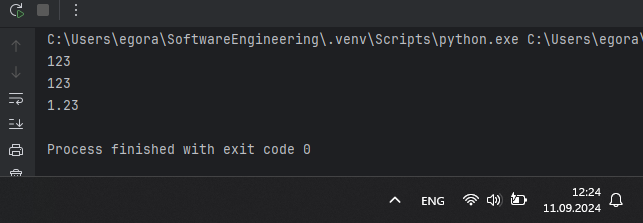

## Выводы

В данном коде выводятся три строки с использованием функции `print()`. Первая строка выводит целое число 123, вторая строка выводит строку '123' (уже в виде текстовой строки, а не числа), а третья строка выводит число 1.23 с плавающей точкой (в виде числа, как и в 1 случае).

## Лабораторная работа №2
### 

```python

```
### Результат.
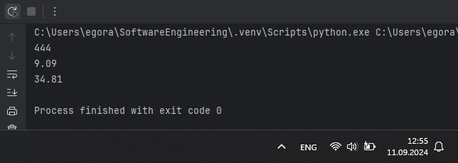

## Выводы

В данном коде 

## Лабораторная работа №3
### 

```python

```
### Результат.
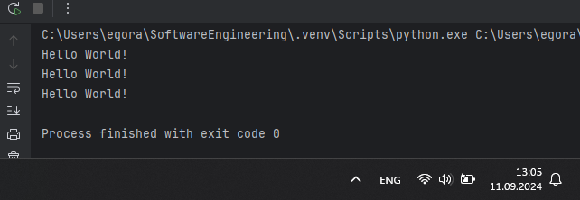

## Выводы

В данном коде 

## Лабораторная работа №4
### 

```python

```
### Результат.
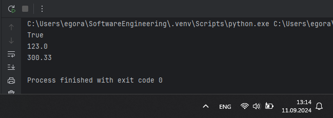

## Выводы

В данном коде 

## Лабораторная работа №5
### 

```python

```
### Результат.
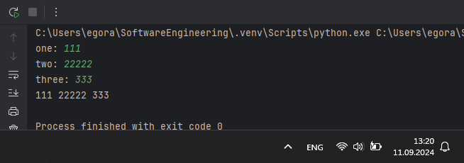

## Выводы

В данном коде 

## Лабораторная работа №6
### 

```python

```
### Результат.
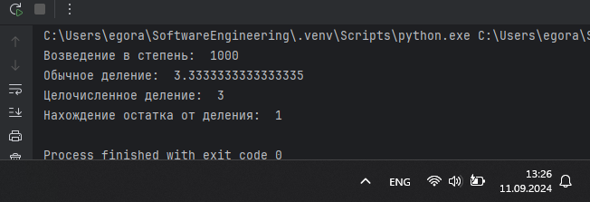

## Выводы

В данном коде 

## Лабораторная работа №7
### 

```python

```
### Результат.
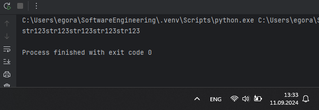

## Выводы

В данном коде 

## Лабораторная работа №8
### 

```python

```
### Результат.
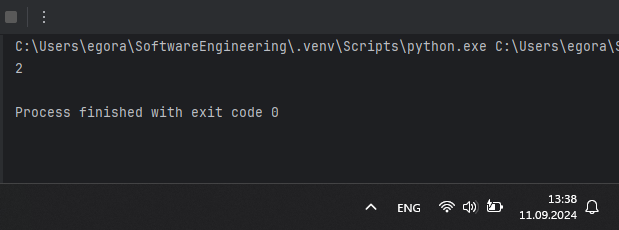

## Выводы

В данном коде 

## Лабораторная работа №9
### 

```python

```
### Результат.
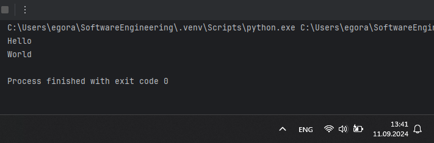

## Выводы

В данном коде 

## Лабораторная работа №10
### 

```python

```
### Результат.
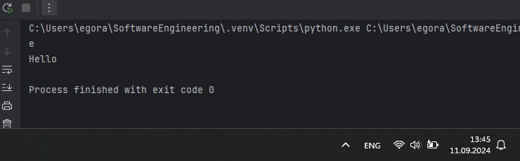

## Выводы

В данном коде 

## Самостоятельная работа №1
### 

```python

```
### Результат.
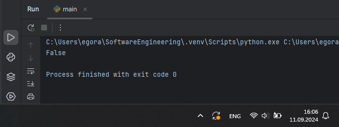

## Выводы

В данном коде 

## Самостоятельная работа №2
### 

```python

```
### Результат.
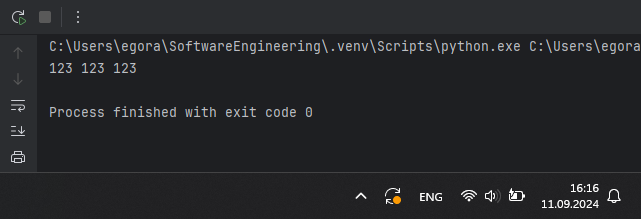

## Выводы

В данном коде 

## Самостоятельная работа №3
### 

```python

```
### Результат.
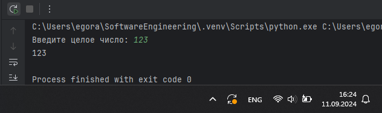

## Выводы

В данном коде 

## Самостоятельная работа №4
### 

```python

```
### Результат.
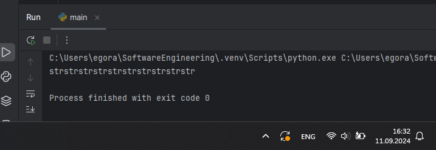

## Выводы

В данном коде 

## Самостоятельная работа №5
### 

```python

```
### Результат.
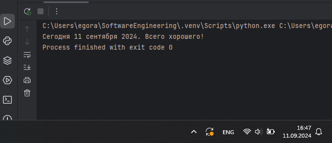

## Выводы

В данном коде 

## Самостоятельная работа №6
### 

```python

```
### Результат.
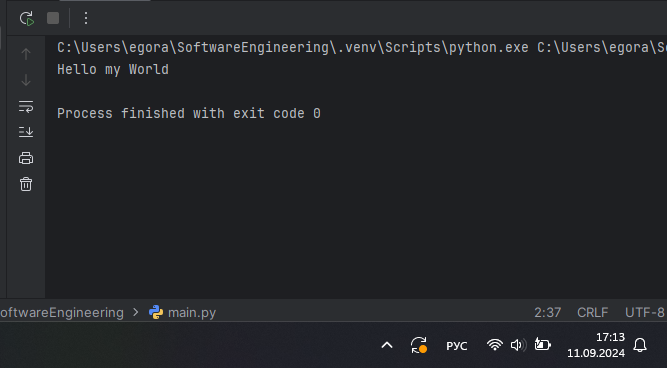

## Выводы

В данном коде 

## Самостоятельная работа №7
### 

```python

```
### Результат.
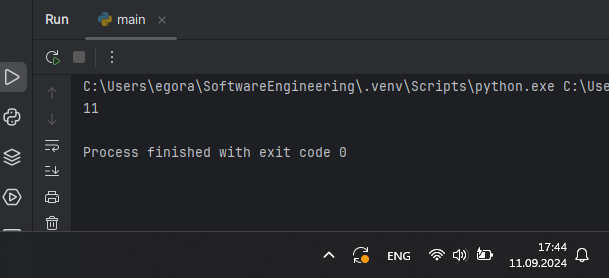

## Выводы

В данном коде 

## Самостоятельная работа №8
### 

```python

```
### Результат.
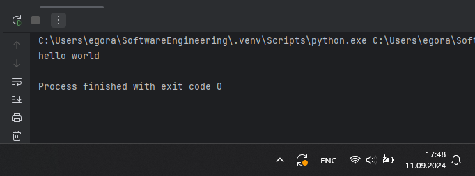

## Выводы

В данном коде 

## Самостоятельная работа №9
### 

```python

```
### Результат.
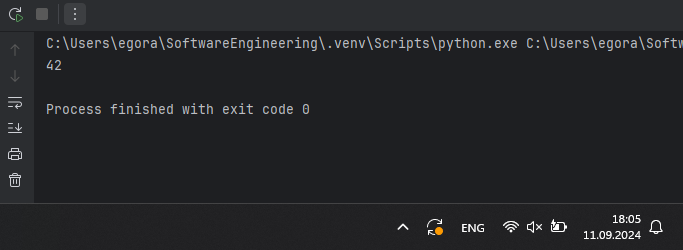

## Выводы

В данном коде 

## Самостоятельная работа №10
### 

```python

```
### Результат.
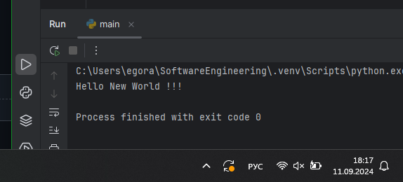

## Выводы

В данном коде 

## Общие выводы по теме
- Развернутый вывод
