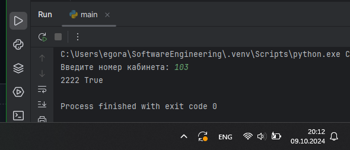
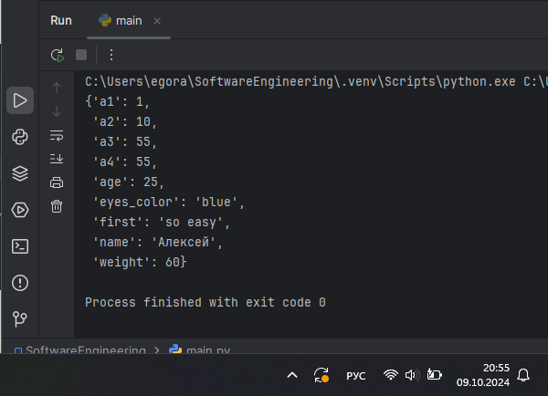
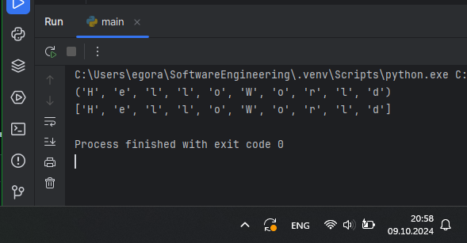
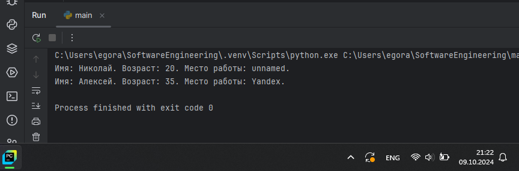
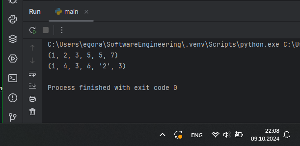
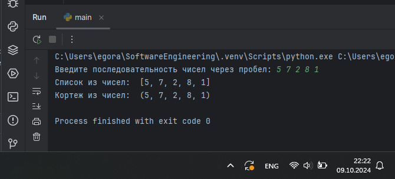
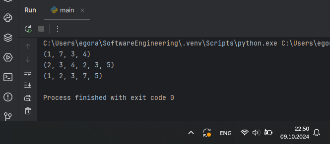
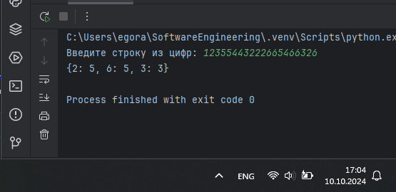
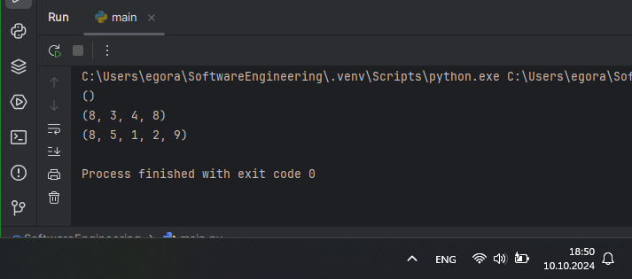
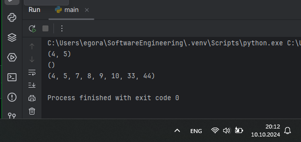

# Тема 6. Базовые коллекции: словари, кортежи
Отчет по Теме #6 выполнил(а):
- Аверкиев Егор Алексеевич
- ИВТ-22-1

| Задание | Лаб_раб | Сам_раб |
| ------ | ------ | ------ |
| Задание 1 | + | + |
| Задание 2 | + | + |
| Задание 3 | + | + |
| Задание 4 | + | + |
| Задание 5 | + | + |

знак "+" - задание выполнено; знак "-" - задание не выполнено;

Работу проверили:
- к.э.н., доцент Панов М.А.

## Лабораторная работа №1
### В школе, где вы учились, узнали, что вы крутой программист и попросили написать программу для учителей, которая будет при вводе кабинета писать для него ключ доступа и статус, занят кабинет или нет. При написании программы необходимо использовать словарь (dict), который на вход получает номер кабинета, а выводит необходимую информацию. Если кабинета, который вы ввели нет в словаре, то в консоль в виде значения ключа нужно вывести “None” и виде статуса вывести “False”.

```python

```
### Результат.


## Выводы

В данном коде 

## Лабораторная работа №2
### Алексей решил создать самый большой словарь в мире. Для этого он придумал функцию dict_maker (**kwargs), которая принимает неограниченное количество параметров «ключ: значение» и обновляет созданный им словарь my_dict, состоящий всего из одного элемента «first» со значением «so easy». Помогите Алексею создать данную функцию.

```python

```
### Результат.


## Выводы

В данном коде 

## Лабораторная работа №3
### Для решения некоторых задач бывает необходимо разложить строку на отдельные символы. Мы знаем что это можно сделать при помощи split(), у которого более гибкая настройка для разделения для этого, но если нам нужно посимвольно разделить строку без всяких условий, то для этого мы можем использовать кортежи (tuple). Для этого напишем любую строку, которую будем делить и “обвернем” ее в tuple и дальше мы можем как нам угодно с ней работать, например, сделать ее списком (тогда получится полный аналог split()) или же работать с ним дальше, как с кортежем.

```python

```
### Результат.


## Выводы

В данном коде 

## Лабораторная работа №4
### Вовочка решил написать крутую функцию, которая будет писать имя, возраст и место работы, но при этом на вход этой функции будет поступать кортеж. Помогите Вовочке написать эту программу.

```python

```
### Результат.


## Выводы

В данном коде 

## Лабораторная работа №5
### Для сопровождения первых лиц государства X нужен кортеж, но никто не может определиться с порядком машин, поэтому вам нужно написать функцию, которая будет сортировать кортеж, состоящий из целых чисел по возрастанию, и возвращает его. Если хотя бы один элемент не является целым числом, то функция возвращает исходный кортеж.

```python

```
### Результат.


## Выводы

В данном коде 

## Самостоятельная работа №1
### При создании сайта у вас возникла потребность обрабатывать данные пользователя в странной форме, а потом переводить их в нужные вам форматы. Вы хотите принимать от пользователя последовательность чисел, разделенных пробелом, а после переформатировать эти данные в список и кортеж. Реализуйте вашу задумку. Для получения начальных данных используйте input(). Результатом программы будет выведенный список и кортеж из начальных данных.

```python

```
### Результат.


## Выводы

В данном коде 

## Самостоятельная работа №2
### Николай знает, что кортежи являются неизменяемыми, но он очень упрямый и всегда хочет доказать, что он прав. Студент решил создать функцию, которая будет удалять первое появление определенного элемента из кортежа по значению и возвращать кортеж без него. Попробуйте повторить шедевр не признающего авторитеты начинающего программиста. Но учтите, что Николай не всегда уверен в наличии элемента в кортеже (в этом случае кортеж вернется функцией в исходном виде).

Входные данные:

(1, 2, 3), 1)

(1, 2, 3, 1, 2, 3, 4, 5, 2, 3, 4, 2, 4, 2), 3)

(2, 4, 6, 6, 4, 2), 9)

Ожидаемый результат:

(2, 3)

(1, 2, 1, 2, 3, 4, 5, 2, 3, 4, 2, 4, 2)

(2, 4, 6, 6, 4, 2)

```python

```
### Результат.


## Выводы

В данном коде 

## Самостоятельная работа №3
### Ребята поспорили кто из них одним нажатием на numpad наберет больше повторяющихся цифр, но не понимают, как узнать победителя. Вам им нужно в этом помочь. Дана строка в виде случайной последовательности чисел от 0 до 9 (длина строки минимум 15 символов). Требуется создать словарь, который в качестве ключей будет принимать данные числа (т. е. ключи будут типом int), а в качестве значений – количество этих чисел в имеющейся последовательности. Для построения словаря создайте функцию, принимающую строку из цифр. Функция должна возвратить словарь из 3-х самых часто встречаемых чисел, также эти значения нужно вывести в порядке возрастания ключа.

```python

```
### Результат.


## Выводы

В данном коде 

## Самостоятельная работа №4
### Ваш хороший друг владеет офисом со входом по электронным картам, ему нужно чтобы вы написали программу, которая показывала в каком порядке сотрудники входили и выходили из офиса. Определение сотрудника происходит по id. Напишите функцию, которая на вход принимает кортеж и случайный элемент (id), его можно придумать самостоятельно. Требуется вернуть новый кортеж, начинающийся с первого появления элемента в нем и заканчивающийся вторым его появлением включительно. Если элемента нет вовсе – вернуть пустой кортеж. Если элемент встречается только один раз, то вернуть кортеж, который начинается с него и идет до конца исходного.

Входные данные:

(1, 2, 3), 8)

(1, 8, 3, 4, 8, 8, 9, 2), 8)

(1, 2, 8, 5, 1, 2, 9), 8)

Ожидаемый результат:

()

(8, 3, 4, 8)

(8, 5, 1, 2, 9)

```python

```
### Результат.


## Выводы

В данном коде 

## Самостоятельная работа №5
### Самостоятельно придумайте и решите задачу, в которой будут обязательно использоваться кортеж или список. Проведите минимум три теста для проверки работоспособности вашей задачи. Задача: 

```python

```
### Результат.


## Выводы

В данном коде 

## Общие выводы по теме
- Развернутый вывод
