# Тема 7. Работа с файлами (ввод, вывод)
Отчет по Теме #7 выполнил(а):
- Аверкиев Егор Алексеевич
- ИВТ-22-1

| Задание | Лаб_раб | Сам_раб |
| ------ | ------ | ------ |
| Задание 1 | + | + |
| Задание 2 | + | + |
| Задание 3 | + | + |
| Задание 4 | + | + |
| Задание 5 | + | + |
| Задание 6 | + |  |
| Задание 7 | + |  |
| Задание 8 | + |  |
| Задание 9 | + |  |
| Задание 10 | + |  |

знак "+" - задание выполнено; знак "-" - задание не выполнено;

Работу проверили:
- к.э.н., доцент Панов М.А.

## Лабораторная работа №1
### Составьте текстовый файл и положите его в одну директорию с программой на Python. Текстовый файл должен состоять минимум из двух строк.

### Результат.
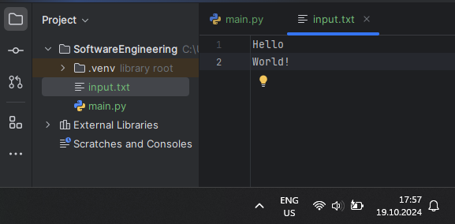

## Выводы

В данной лабораторной работе был создан текстовый файл, который состоит из 2 строк: 'Hello' и 'World!'.

## Лабораторная работа №2
### Напишите программу, которая выведет только первую строку из вашего файла, при этом используйте конструкцию open()/close().

```python
file = open('input.txt', 'r')
print(file.readline())
file.close()
```
### Результат.
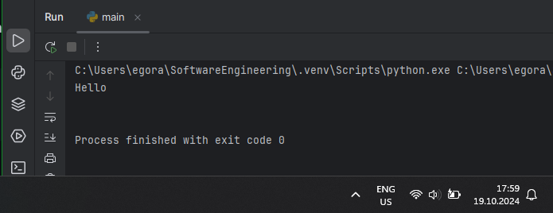

## Выводы

В данном коде открывается для чтения файл input.txt и выводится его первая строка, прочитанная с помощью метода readline(). Затем файл закрывается.

## Лабораторная работа №3
### Напишите программу, которая выведет все строки из вашего файла в массиве, при этом используйте конструкцию open()/close().

```python
file = open('input.txt', 'r')
print(file.readlines())
file.close()
```
### Результат.
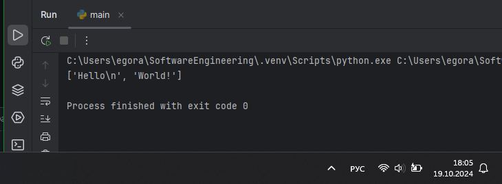

## Выводы

В данном коде открывается для чтения файл input.txt и выводятся все его строки, прочитанные с помощью метода readlines(). Затем файл закрывается.

## Лабораторная работа №4
### Напишите программу, которая выведет все строки из вашего файла в массиве, при этом используйте конструкцию with open().

```python
with open('input.txt') as file:
    print(file.readlines())
```
### Результат.
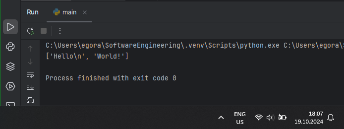

## Выводы

В данном коде открывается файл input.txt и выводятся все его строки, прочитанные методом readlines(). Здесь используется конструкция with open(), благодаря которой файл автоматически закрывается после использования.

## Лабораторная работа №5
### Напишите программу, которая выведет каждую строку из вашего файла отдельно, при этом используйте конструкцию with open().

```python
with open('input.txt') as file:
    for line in file:
        print(line)
```
### Результат.
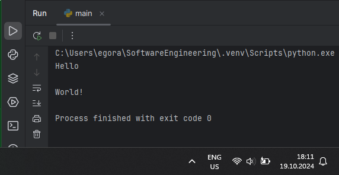

## Выводы

В данном коде открывается файл, после чего каждая его строка выводится отдельно на экран. При этом используется конструкция with open(), которая автоматически закрывает файл после его использования.

## Лабораторная работа №6
### Напишите программу, которая будет добавлять новую строку в ваш файл, а потом выведет полученный файл в консоль. Вывод можно осуществлять любым способом. Обязательно проверьте сам файл, чтобы изменения в нем тоже отображались.

```python
with open('input.txt', 'a+') as file:
    file.write('\nIt is new line')

with open('input.txt', 'r') as file:
    result = file.readlines()
    print(result)
```
### Результат.
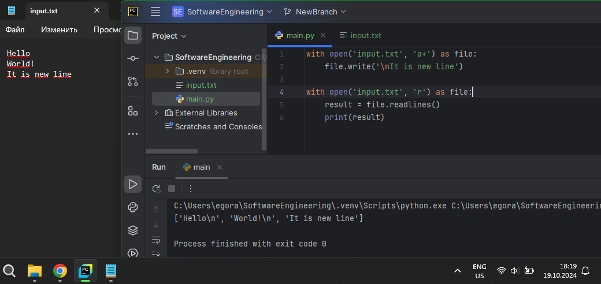

## Выводы

В данном коде с помощью метода write() добавляется новая строка в конец файла, после чего он повторно открывается, и происходит вывод всех его строк (вместе с добавленной строкой).

## Лабораторная работа №7
### Напишите программу, которая перепишет всю информацию, которая была у вас в файле до этого, например напишет любые данные из произвольно вами составленного списка. Также не забудьте проверить что измененная вами информация сохранилась в файле.

```python
lines = ['one', 'two', 'three']
with open ('input.txt', 'w') as file:
    for line in lines:
        file.write('\nCycle run ' + line)
    print('Готово')
```
### Результат.
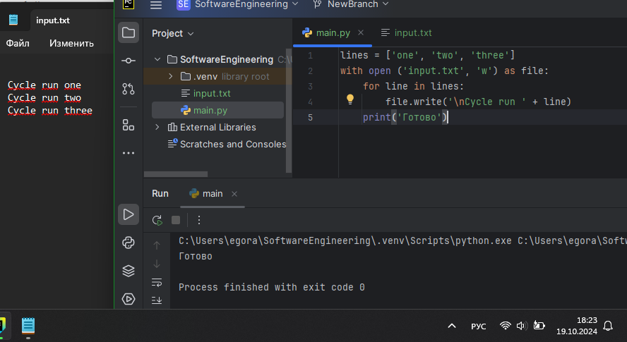

## Выводы

В данном коде в файл input.txt записываются новые строки, причем старое содержимое файла перед этим очищается. После завершения записи на экран выводится строка "Готово".

## Лабораторная работа №8
### Выберите любую папку на своем компьютере, имеющую вложенные директории. Выведите на печать в терминал ее содержимое, как и всех подкаталогов при помощи функции print_docs(directory).

```python
import os

def print_docs(directory):
    all_files = os.walk(directory)
    for catalog in all_files:
        print(f'Папка {catalog[0]} содержит: ')
    print(f'Директории: {", ".join([folder for folder in catalog[1]])}')
    print(f'Файлы: {", ".join([file for file in catalog[2]])}')
    print('-' * 40)

print_docs('C:/Users/egora/Pictures')
```
### Результат.
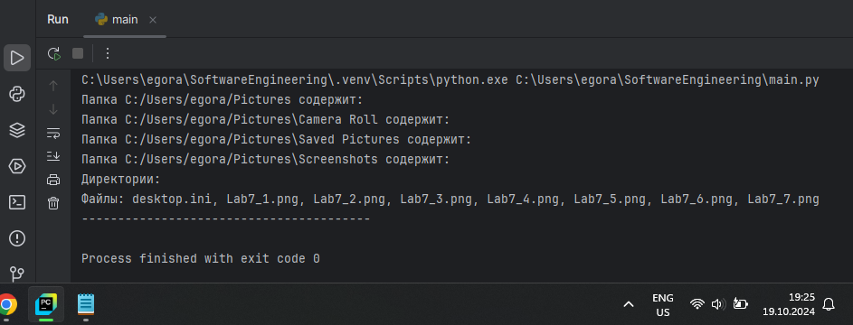

## Выводы

В данном коде продемонстрирована работа созданной функции print_docs(), которая выводит список папок, директорий и файлов, которые содержатся по указанному пути.

## Лабораторная работа №9
### Документ «input.txt» содержит следующий текст:

Приветствие

Спасибо

Извините

Пожалуйста

До свидания

Ты готов?

Как дела?

С днем рождения!

Удача!

Я тебя люблю.

Требуется реализовать функцию, которая выводит слово, имеющее максимальную длину (или список слов, если таковых несколько).

```python
def longest_words(file):
    with open(file, encoding = 'utf-8') as f:
        words = f.read().split()
        sought_words = []
        max_length = len(max(words, key = len))
        for word in words:
            if len(word) == max_length:
                sought_words.append(word)
        if len(sought_words) == 1:
            return sought_words[0]
        return sought_words

print(longest_words('input.txt'))
```
### Результат.
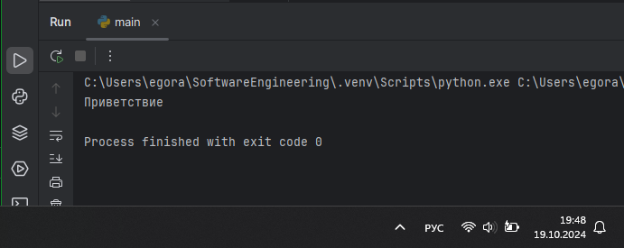

## Выводы

В данном коде реализована работа функции longest_words(), которая находит и выводит слово/слова с максимальной длиной в указанном файле.

## Лабораторная работа №10
### Требуется создать csv-файл «rows_300.csv» со следующими столбцами:

•	№ - номер по порядку (от 1 до 300);
 
•	Секунда – текущая секунда на вашем ПК;

•	Микросекунда – текущая миллисекунда на часах.

Для наглядности на каждой итерации цикла искусственно приостанавливайте скрипт на 0,01 секунды.

```python
import csv
import datetime
import time

with open('rows_300.csv', 'w', encoding = 'utf-8', newline = '') as f:
    writer = csv.writer(f)
    writer.writerow(['№', 'Секунда', 'Микросекунда'])
    for line in range(1, 301):
        writer.writerow([line, datetime.datetime.now().second,
                         datetime.datetime.now().microsecond])
        time.sleep(0.01)
```
### Результат.
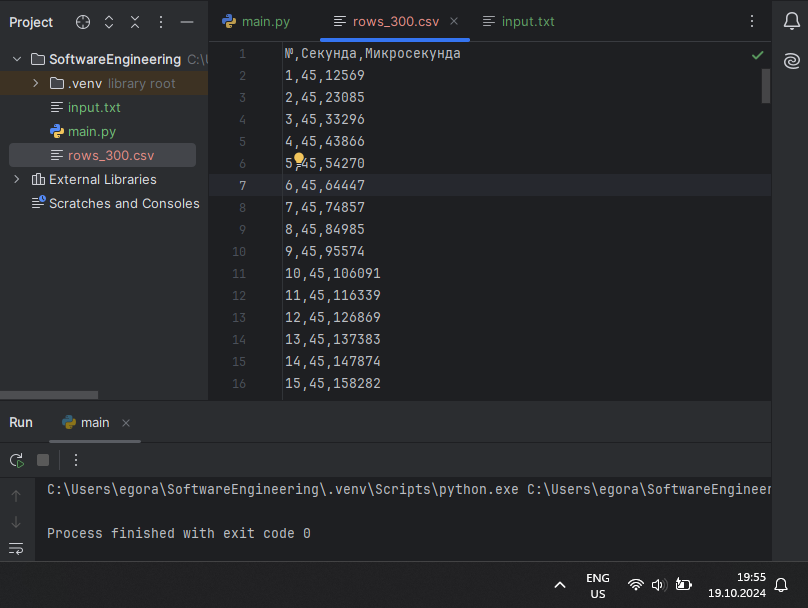

## Выводы

В данном коде создается csv-файл со столбцами "№", "Секунда" и "Микросекунда". Всего с помощью цикла создается 300 строк (не считая шапку таблицы) с номерами от 1 до 300 включительно. После создания каждой строки работа программы приостанавливается на 0,01 секунды. В каждой строке таблицы указываются текущие секунды и микросекунды.

## Самостоятельная работа №1
### Найдите в интернете любую статью (объем статьи не менее 200 слов), скопируйте ее содержимое в файл и напишите программу, которая считает количество слов в текстовом файле и определит самое часто встречающееся слово. Результатом выполнения задачи будет: скриншот файла со статьей, листинг кода, и вывод в консоль, в котором будет указана вся необходимая информация.

```python
def analyze_text(file):
    try:
        with open(file, 'r', encoding='utf-8') as f:
            text = f.read()
            words = text.split()
            word_count = len(words)
            frequency = {}

            for word in words:
                word = word.lower()
                if word in frequency:
                    frequency[word] += 1
                else:
                    frequency[word] = 1

            most_common_word = ""
            most_common_count = 0
            for word, count in frequency.items():
                if count > most_common_count:
                    most_common_count = count
                    most_common_word = word

            print(f'Количество слов в файле: {word_count}')
            print(f'Самое часто встречающееся слово: {most_common_word}. Оно встречается {most_common_count} раз')

    except Exception as e:
        print("Произошла ошибка:", str(e))

analyze_text('input.txt')
```
### Результат.
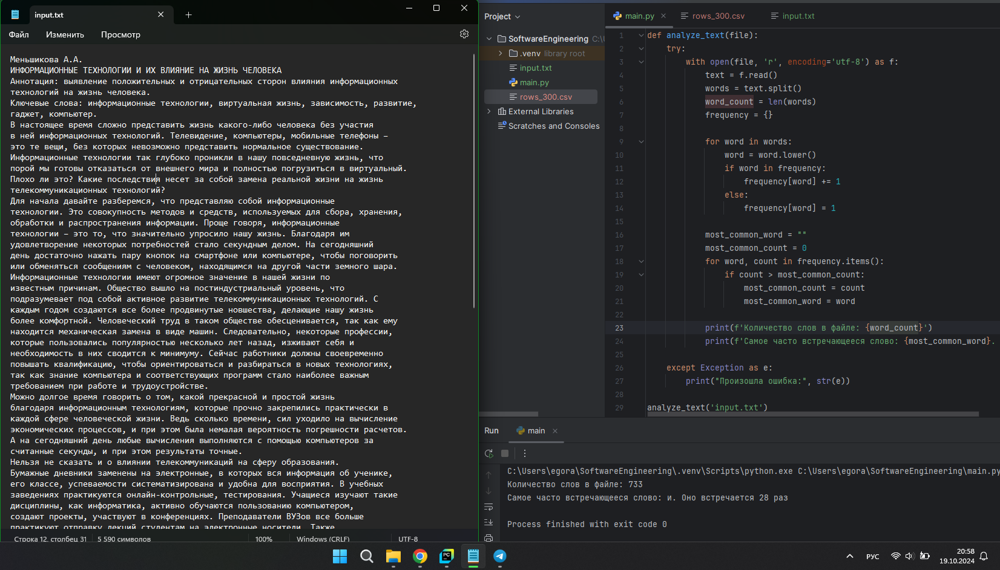

## Выводы

В данном коде реализована работа функции analyze_text(), которая считает количество слов в файле и определяет самое часто встречающееся слово. Текст разбивается на отдельные слова с помощью метода split(). Частота слов подсчитывается с применением словаря, где ключ - это само слово, а значение - его количество в тексте. При этом для более правильного подсчета все слова переводятся в нижний регистр.

## Самостоятельная работа №2
### У вас появилась потребность в ведении книги расходов, посмотрев все существующие варианты вы пришли к выводу что вас ничего не устраивает и нужно все делать самому. Напишите программу для учета расходов. Программа должна позволять вводить информацию о расходах, сохранять ее в файл и выводить существующие данные в консоль. Ввод информации происходит через консоль. Результатом выполнения задачи будет: скриншот файла с учетом расходов, листинг кода, и вывод в консоль, с демонстрацией работоспособности программы.

```python
def input_expenses():
    date = input('Введите дату: ')
    summa = input('Введите сумму расходов: ')
    info = input('Введите описание расходов: ')
    with open('expenses.txt', 'a', encoding = 'utf-8') as file:
        file.write(f'{date}, {summa}, {info}\n')

def read_expenses():
    with open('expenses.txt', 'r', encoding = 'utf-8') as file:
        for line in file:
            print(line)

while True:
    command = input('1 - добавить расходы. 2 - вывести информацию о расходах: ')
    if command == '1':
        input_expenses()
    elif command == '2':(
        read_expenses())
    else:
        print('Неверная команда')
```
### Результат.
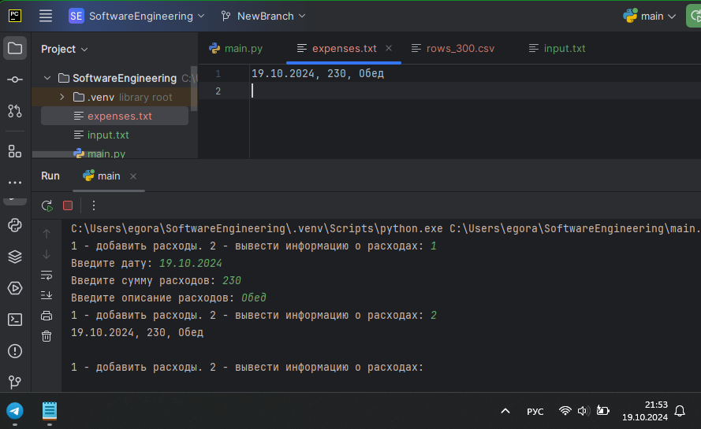

## Выводы

В данном коде пользователю дается возможность добавлять расходы (1) или выводить информацию о них (2). При добавлении расходов нужно указать дату, сумму и описание. Полученная информация запишется в файл expenses.txt и ее можно будет просмотреть.

## Самостоятельная работа №3
### Имеется файл input.txt с текстом на латинице. Напишите программу, которая выводит следующую статистику по тексту: количество букв латинского алфавита; число слов; число строк.

•	Текст в файле:

Beautiful is better than ugly.

Explicit is better than implicit.

Simple is better than complex.

Complex is better than complicated.

•	Ожидаемый результат: Input file contains:

108 letters

20 words

4 lines

```python
def count_statistics(file):

    with open(file, 'r', encoding='utf-8') as f:
        text = f.read()

    lines = text.count('\n') + 1
    words = len(text.split())
    letters = sum(1 for char in text if char.isalpha())

    print('Input file contains:')
    print(f'{letters} letters')
    print(f'{words} words')
    print(f'{lines} lines')

count_statistics('input.txt')
```
### Результат.
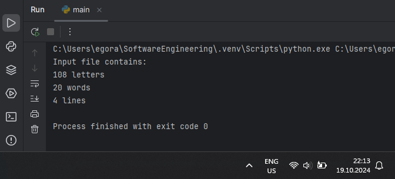

## Выводы

В данном коде реализована работа функции count_statistics(), которая рассчитывает количество букв, слов и строк в передаваемом файле input.txt.

## Самостоятельная работа №4
### Напишите программу, которая получает на вход предложение, выводит его в терминал, заменяя все запрещенные слова звездочками * (количество звездочек равно количеству букв в слове). Запрещенные слова, разделенные символом пробела, хранятся в текстовом файле input.txt. Все слова в этом файле записаны в нижнем регистре. Программа должна заменить запрещенные слова, где бы они ни встречались, даже в середине другого слова. Замена производится независимо от регистра: если файл input.txt содержит запрещенное слово exam, то слова exam, Exam, ExaM, EXAM и exAm должны быть заменены на ****.

•	Запрещенные слова:

hello email python the exam wor is

•	Предложение для проверки:

Hello, world! Python IS the programming language of thE future. My EMAIL is....

PYTHON is awesome!!!!

•	Ожидаемый результат:

*****, ***ld! ****** ** *** programming language of *** future. My ***** **....

****** ** awesome!!!!

```python
import re

def new_text(text, banned_words):
    for word in banned_words:
        pattern = re.compile(re.escape(word), re.IGNORECASE)
        text = pattern.sub('*' * len(word), text)
    return text

test_text = 'Hello, world! Python IS the programming language of thE future. My EMAIL is....\nPYTHON is awesome!!!!'
with open('input.txt', 'r') as file:
    banned_words = file.read().strip().split()
result = new_text(test_text, banned_words)
print(result)
```
### Результат.
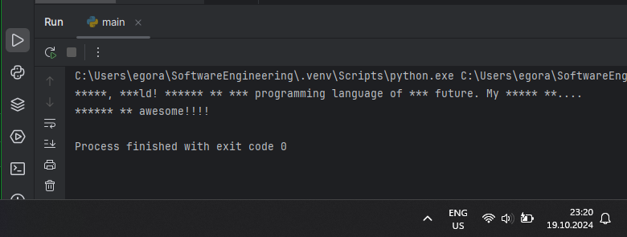

## Выводы

В данном коде реализована работа функции new_text(). Она принимает строку (text), которую нужно изменить и список запрещенных слов, который до этого был получен из файла input.txt. Используется библиотека re, позволяющая выполнять сложные замены в строках. Внутри функции создается регулярное выражение для поиска слова с игнорированием регистра. Затем все встречаемые запрещенные слова заменяются на звездочки. В конце функция возвращает преобразованный текст.

## Самостоятельная работа №5
### Самостоятельно придумайте и решите задачу, которая будет взаимодействовать с текстовым файлом. Задача: написать программу, которая подсчитывает количество чисел в файле и выводит самое большое из них. Например, пусть в файле содержится следующий текст: "Есть 4 сада. В каждом саду есть по 10 яблонь. На каждой яблоне в среднем 85 яблок. Сколько яблок всего?" В этом примере количество чисел = 3, а самое большое число = 85.

```python
def find_numbers(file):
    count = 0
    max_number = None

    with open(file, 'r') as f:
        for line in f:
            words = line.split()
            for word in words:
                if word.isdigit():
                    count += 1
                    number = int(word)
                    if max_number is None or number > max_number:
                        max_number = number

    print(f"Количество чисел: {count}")
    if max_number is not None:
        print(f"Самое большое число: {max_number}")
    else:
        print("Чисел нет в файле")

find_numbers('input.txt')
```
### Результат.
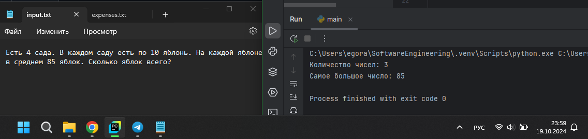

## Выводы

В данном коде реализована работа функции find_numbers(), которая вычисляет количество чисел в файле и находит наибольшее из них. Внутри функции происходит получение отдельных слов из текста. С помощью функции isdigit() определяется, является ли слово числом. Если да, то их количество прибавляется на 1 и проверяется, является ли оно максимальным. Итоговый результат по подсчетам выводится в консоль.

## Общие выводы по теме
- Работа с файлами позволяет эффективно работать с данными: читать, записывать и обрабатывать их. Основные функции, которые обычно используются при работе с файлами - это: 1) открытие файлов (open()); 2) чтение данных (read(), readline() и readlines()); 3) запись данных (write() и writelines()); 4) закрытие файлов (close()). Все эти возможности делают работу с файлами важной частью разработки ПО.
