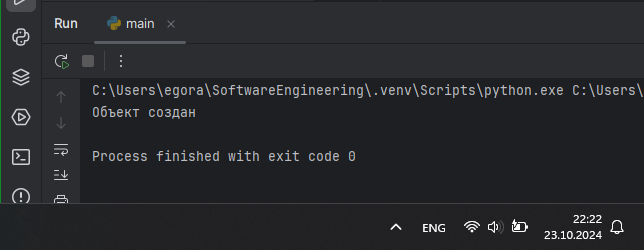

# Тема 8. Основы объектно-ориентированного программирования
Отчет по Теме #8 выполнил(а):
- Аверкиев Егор Алексеевич
- ИВТ-22-1

| Задание | Лаб_раб | Сам_раб |
| ------ | ------ | ------ |
| Задание 1 | + | + |
| Задание 2 | + | + |
| Задание 3 | + | + |
| Задание 4 | + | + |
| Задание 5 | + | + |

знак "+" - задание выполнено; знак "-" - задание не выполнено;

Работу проверили:
- к.э.н., доцент Панов М.А.

## Лабораторная работа №1
### Создайте класс “Car” с атрибутами производитель и модель. Создайте объект этого класса. Напишите комментарии для кода, объясняющие его работу. Результатом выполнения задания будет листинг кода с комментариями.

```python
#Создание класса Car
class Car:
    #Метод инициализации класса
    def __init__(self, make, model):
        #Присваивание параметров make и model атрибутам экземпляра
        self.make = make
        self.model = model

#Создание экземпляра класса Car с производителем Toyota и моделью Corolla
my_car = Car("Toyota", "Corolla")
```
### Результат.


## Выводы

В данном коде создается класс "Car" с атрибутами "make" (производитель) и "model" (модель). Затем создается экземпляр этого класса с производителем Toyota и моделью Corolla.

## Лабораторная работа №2
### Дополните код из первого задания, добавив в него атрибуты и методы класса, заставьте машину “поехать”. Напишите комментарии для кода, объясняющие его работу. Результатом выполнения задания будет листинг кода с комментариями и получившийся вывод в консоль.

```python
#Создание класса Car
class Car:
    #Метод инициализации класса
    def __init__(self, make, model):
        #Присваивание параметров make и model атрибутам экземпляра
        self.make = make
        self.model = model

    #Метод, выводящий в консоль информацию о производителе и модели автомобиля
    def drive(self):
        print(f"Driving the {self.make} {self.model}")

#Создание экземпляра класса Car с производителем Toyota и моделью Corolla
my_car = Car("Toyota", "Corolla")
#Вызов метода drive() у объекта my_car
my_car.drive()
```
### Результат.


## Выводы

Данный код дополнен предыдущим методом drive() класса Car, который выводит информацию об автомобиле, заставляя его "поехать". После создании объекта my_car класса Car вызывается этот добавленный метод drive().

## Лабораторная работа №3
### Создайте новый класс “ElectricCar” с методом “charge” и атрибутом емкость батареи. Реализуйте его наследование от класса, созданного в первом задании. Заставьте машину поехать, а потом заряжаться. Напишите комментарии для кода, объясняющие его работу. Результатом выполнения задания будет листинг кода с комментариями и получившийся вывод в консоль.

```python
#Создание класса Car
class Car:
    #Метод инициализации класса
    def __init__(self, make, model):
        #Присваивание параметров make и model атрибутам экземпляра
        self.make = make
        self.model = model

    #Метод, выводящий в консоль информацию о производителе и модели автомобиля
    def drive(self):
        print(f"Driving the {self.make} {self.model}")

#Создание класса ElectricCar, наследующего атрибуты и методы родительского класса Car
class ElectricCar(Car):
    # Метод инициализации класса
    def __init__(self, make, model, battery_capacity):
        #Вызов конструктора родительского класса
        super().__init__(make, model)
        #Присваивание параметра battery_capacity атрибуту емкости батареи
        self.battery_capacity = battery_capacity

    #Метод зарядки автомобиля
    def charge(self):
        print(f"Charging the {self.make} {self.model} with {self.battery_capacity} kWh")

#Создание экземпляра класса ElectricCar
my_electric_car = ElectricCar("Tesla", "Model S", 75)
#Вызов метода drive() у объекта my_electric_car
my_electric_car.drive()
#Вызов метода charge() у объекта my_electric_car для зарядки автомобиля
my_electric_car.charge()
```
### Результат.


## Выводы

В данном коде создается класс "ElectricCar", который наследует атрибуты и методы родительского класса "Car". Новый класс имеет новый метод charge() для зарядки автомобиля и новый атрибут емкости батареи. Ниже создается объект класса ElectricCar и вызываются его методы.

## Лабораторная работа №4
### Реализуйте инкапсуляцию для класса, созданного в первом задании. Создайте защищенный атрибут производителя и приватный атрибут модели. Вызовите защищенный атрибут и заставьте машину поехать. Напишите комментарии для кода, объясняющие его работу. Результатом выполнения задания будет листинг кода с комментариями и получившийся вывод в консоль.

```python
#Создание класса Car
class Car:
    #Метод инициализации класса
    def __init__(self, make, model):
        #Присваивание параметров make и model атрибутам экземпляра
        self._make = make
        self.__model = model

    #Метод, выводящий в консоль информацию о производителе и модели автомобиля
    def drive(self):
        print(f"Driving the {self._make} {self.__model}")

#Создание экземпляра класса Car с производителем Toyota и моделью Corolla
my_car = Car("Toyota", "Corolla")
#Доступ к защищенному атрибуту
print(my_car._make)
# print(my_car.__model) - будет ошибка, т.к. приватный атрибут не доступен
#Вызов метода drive() у объекта my_car
my_car.drive()
```
### Результат.


## Выводы

В данном коде реализована инкапсуляция для класса Car, который имеет защищенный атрибут "make" и приватный атрибут "model". Ниже создается объект my_car класса Car и вызывается его защищенный атрибут с методом drive().

## Лабораторная работа №5
### Реализуйте полиморфизм создав основной (общий) класс “Shape”, а также еще два класса “Rectangle” и “Circle”. Внутри последних двух классов реализуйте методы для подсчета площади фигуры. После этого создайте массив с фигурами, поместите туда круг и прямоугольник, затем при помощи цикла выведите их площади. Напишите комментарии для кода, объясняющие его работу. Результатом выполнения задания будет листинг кода с комментариями и получившийся вывод в консоль.

```python
# Создание основного класса Shape
class Shape:
    # Метод для подсчета площади фигуры
    def area(self):
        pass

# Создание класса Rectangle, который наследует методы и атрибуты от Shape
class Rectangle(Shape):
    # Метод инициализации класса
    def __init__(self, width, height):
        self.width = width # Ширина
        self.height = height # Высота

    # Метод для подсчета площади фигуры
    def area(self):
        return self.width * self.height

# Создание класса Circle, который наследует методы и атрибуты от Shape
class Circle(Shape):
    # Метод инициализации класса
    def __init__(self, radius):
        self.radius = radius # Радиус

    # Метод для подсчета площади фигуры
    def area(self):
        return 3.14 * self.radius * self.radius

#  Список с фигурами
arr = [Rectangle(5, 8), Circle(4)]
# Вызов метода area для подсчета площади у каждой фигуры
for elem in arr:
    print(elem.area())
```
### Результат.


## Выводы

В данном коде реализован полиморфизм с использованием основного класса "Shape" и двух дочерних классов "Rectangle" и "Circle". Внутри каждого класса реализован метод area() для подсчета площади фигур. Вне классов создается список с объектами дочерних классов и вызывается метод area() с различной реализацией для каждого объекта.

## Самостоятельная работа №1
### Самостоятельно создайте класс и его объект. Они должны отличаться, от тех, что указаны в теоретическом материале (методичке) и лабораторных заданиях. Результатом выполнения задания будет листинг кода и получившийся вывод консоли.

```python
class Animal:
    def __init__(self, name, age, weight):
        self.name = name
        self.age = age
        self.weight = weight

cat = Animal("Барсик", 2, 5)
```
### Результат.


## Выводы

В данном коде создается класс Animal с атрибутами name, age и weight. Вне класса создается объект этого класса cat. После создания объекта в консоль выводится информация о том, что объект создан.

## Самостоятельная работа №2
### Самостоятельно создайте атрибуты и методы для ранее созданного класса. Они должны отличаться, от тех, что указаны в теоретическом материале (методичке) и лабораторных заданиях. Результатом выполнения задания будет листинг кода и получившийся вывод консоли.

```python
class Animal:
    def __init__(self, name, age, weight):
        self.name = name
        self.age = age
        self.weight = weight

    def info(self):
        print(f"Меня зовут {self.name}. Сколько мне лет? Мне сейчас {self.age}. Кстати, мой вес - {self.weight} кг!")

    def sound(self):
        pass

cat = Animal("Барсик", 2, 5)
cat.info()
```
### Результат.


## Выводы

В данном коде создается класс Animal с атрибутами name, age и weight. Помимо метода инициализации, у класса есть еще 2 метода - info() и sound(). Вне класса создается объект cat и вызывается его метод info().

## Самостоятельная работа №3
### Самостоятельно реализуйте наследование, продолжая работать с ранее созданным классом. Оно должно отличаться, от того, что указано в теоретическом материале (методичке) и лабораторных заданиях. Результатом выполнения задания будет листинг кода и получившийся вывод консоли.

```python
class Animal:
    def __init__(self, name, age, weight):
        self.name = name
        self.age = age
        self.weight = weight

    def info(self):
        print(f"Меня зовут {self.name}. Сколько мне лет? Мне сейчас {self.age}. Кстати, мой вес - {self.weight} кг!")

    def sound(self):
        pass

class Cat(Animal):
    def __init__(self, name, age, weight, breed):
        super().__init__(name, age, weight)
        self.breed = breed

    def sound(self):
        print("Мяу-Мяу!")

cat1 = Cat("Жасмина", 2, 5, "Сиамская")
cat1.info()
cat1.sound()
```
### Результат.


## Выводы

В данном коде реализовано наследование: класс Animal является родительским, а Cat - дочерним. При наследовании переопределяется метод sound(), а также добавляется атрибут breed - порода. Вне класса создается объект cat1 класса Cat и вызываются методы этого объекта.

## Самостоятельная работа №4
### Самостоятельно реализуйте инкапсуляцию, продолжая работать с ранее созданным классом. Она должна отличаться, от того, что указана в теоретическом материале (методичке) и лабораторных заданиях. Результатом выполнения задания будет листинг кода и получившийся вывод консоли.

```python
class Animal:
    def __init__(self, name, age, weight):
        self.name = name
        self._age = age
        self.__weight = weight

    def info(self):
        print(f"Меня зовут {self.name}. Сколько мне лет? Мне сейчас {self._age}. Кстати, мой вес - {self.__weight} кг!")

    def sound(self):
        pass

cat = Animal("Мурзик", 4, 7)
print(cat._age)
cat.info()
```
### Результат.


## Выводы

В данном коде реализована инкапсуляция: в классе Animal есть защищенный атрибут age и приватный атрибут weight. Вне класса создается объект cat класса Animal и выводится его защищенный атрибут с методом info().

## Самостоятельная работа №5
### Самостоятельно реализуйте полиморфизм. Он должен отличаться, от того, что указан в теоретическом материале (методичке) и лабораторных заданиях. Результатом выполнения задания будет листинг кода и получившийся вывод консоли.

```python
class Animal:
    def sound(self):
        pass

class Cat(Animal):
    def sound(self):
        print("Мяу-мяу!")

class Dog(Animal):
    def sound(self):
        print("Гав-гав!")

class Cow(Animal):
    def sound(self):
        print("Муу-ууу!")

animals = [Cat(), Dog(), Cow()]
for animal in animals:
    animal.sound()
```
### Результат.


## Выводы

В данном коде реализован полиморфизм с использованием основного класса Animal и трех дочерних классов Cat, Dog и Cow. Все они имеют общий метод sound(), который переопределяется в каждом дочернем классе. Вне классов создается список с объектами этих дочерних классов и у каждого вызывается метод sound(). 


## Общие выводы по теме
- Основы объектно-ориентированного программирования в Python включают в себя такие ключевые концепции, как: наследование (возможность создавать новые классы на основе существующих), инкапсуляция (защита данных от изменений извне) и полиморфизм (переопределение методов, унаследованных от суперкласса, в подклассах). Важно уметь применять эти концепции на практике, поскольку вместе они помогают в организации и структурировании кода.
